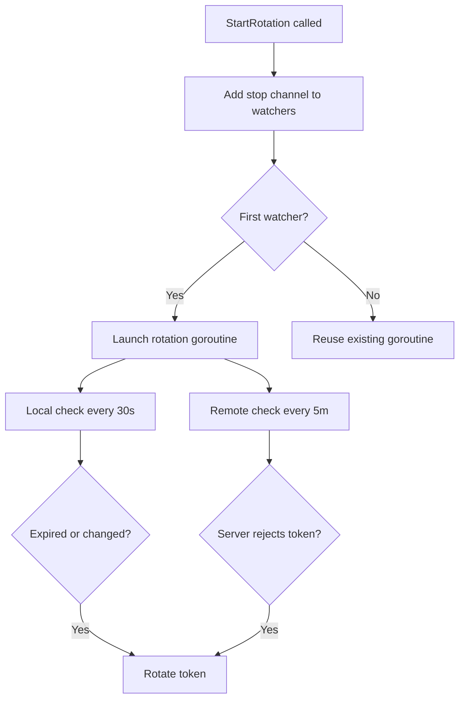

<!-- source-hash: 50400efd1da78a607e7ff91202c32b73 -->
Manages reading, writing, and automatic rotation of orbit agent tokens stored on disk, with support for remote server synchronization and periodic validity checks.

## Key Components

| Export | Type | Description |
|--------|------|-------------|
| `ReadWriter` | struct | Extends `Reader` with write, rotate, and rotation-watcher capabilities |
| `NewReadWriter` | func | Constructor; sets 30s local and 5m remote check intervals |
| `LoadOrGenerate` | method | Reads existing token from disk or generates a new one if absent |
| `Rotate` | method | Generates a new UUID token, writes it to disk with up to 3 retries |
| `Write` | method | Persists a token string, syncs to remote, fixes permissions, and updates `mtime` |
| `SetRemoteUpdateFunc` | method | Registers a callback invoked before each disk write to push the token to a remote server |
| `StartRotation` | method | Starts background goroutines for local TTL checks and remote validity checks; returns a stop function |

## Usage Example

```go
rw := token.NewReadWriter("/var/lib/orbit/identifier", func(tok string) error {
    return verifyTokenWithServer(tok)
})

// Load from disk, or generate if missing
if err := rw.LoadOrGenerate(); err != nil {
    log.Fatal(err)
}

// Push new tokens to Fleet server on rotation
rw.SetRemoteUpdateFunc(func(tok string) error {
    return fleetClient.UpdateToken(tok)
})

// Start background rotation; stop when done
stopRotation := rw.StartRotation()
defer stopRotation()
```

## Rotation Behavior



> **Note:** Multiple callers can register via `StartRotation`; the single background goroutine stops only when all callers have invoked their returned stop function.