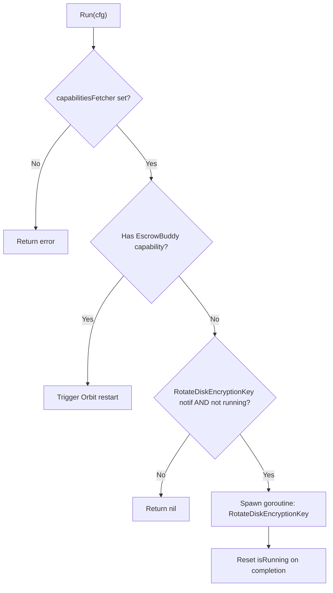

<!-- source-hash: 9094d5a73dd68d3e535de8c707cac6b2 -->
Handles disk encryption key rotation as an Orbit config receiver middleware, triggering background key rotation when notified by the Fleet server.

## Key Components

- **`DiskEncryptionRunner`** — Struct implementing `fleet.OrbitConfigReceiver` with atomic concurrency guard (`isRunning`) to prevent overlapping rotation attempts.
- **`ApplyDiskEncryptionRunnerMiddleware`** — Constructor that wires a capabilities fetcher and an Orbit restart trigger into a `DiskEncryptionRunner`.
- **`Run(cfg *fleet.OrbitConfig) error`** — Core handler called on each config poll. Skips rotation if `CapabilityEscrowBuddy` is detected (triggering an Orbit restart to switch to the newer mechanism) or if a rotation goroutine is already active.
- **`maxRetries`** — Package-level constant (`2`) passed to `useraction.RotateDiskEncryptionKey` on failure.

## Flow



## Usage Example

```go
runner := ApplyDiskEncryptionRunnerMiddleware(
    func() fleet.CapabilityMap { return serverCapabilities },
    func(reason string) { orbitRestart(reason) },
)

// Called automatically by the Orbit update loop on each config fetch
if err := runner.Run(orbitConfig); err != nil {
    log.Error().Err(err).Msg("disk encryption runner failed")
}
```

## Notes

- Only one rotation goroutine runs at a time; concurrent `Run` calls are safely dropped via `atomic.Bool.Swap`.
- Detection of `CapabilityEscrowBuddy` causes an Orbit restart so the newer Escrow Buddy-based flow takes over, making this runner a transitional compatibility layer.
- Source: [`disk_encryption.go`](https://github.com/flamingo-stack/fleetmdm/blob/main/orbit/pkg/update/disk_encryption.go)