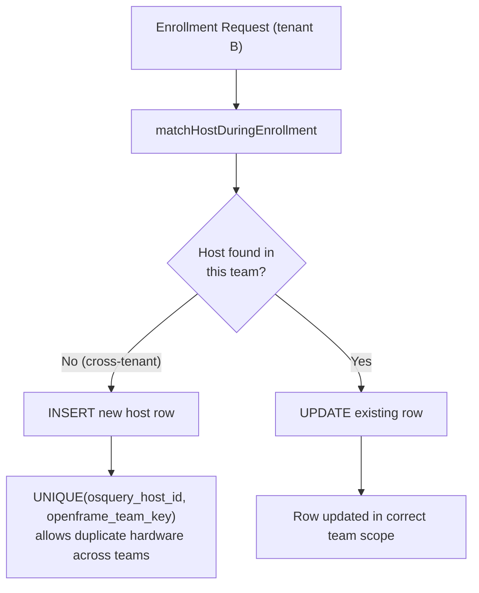

<!-- source-hash: 51314fc094e860f6d1f1fb2438d4e72c -->
Database migration that replaces the global `UNIQUE(osquery_host_id)` constraint on the `hosts` table with a per-team unique constraint, enabling the same physical device to enroll across multiple tenant teams under shared-database multitenancy.

## Key Components

| Symbol | Description |
|---|---|
| `Up_20260626000001` | Applies the migration: adds `openframe_team_key` generated column, creates `idx_hosts_team_osquery_host_id`, drops `idx_osquery_host_id` |
| `Down_20260626000001` | No-op rollback (intentionally empty) |
| `openframe_team_key` | Virtual `INT UNSIGNED` generated column: `IFNULL(team_id, 0)` — maps `NULL` team rows to sentinel `0`, preserving single-tenant behaviour |
| `idx_hosts_team_osquery_host_id` | New composite unique key `(osquery_host_id, openframe_team_key)` — enforces at-most-one host per `(team, osquery_host_id)` |
| `idx_osquery_host_id` | Legacy global unique index — dropped after new index is in place |

## Design Rationale



The `NULL`-safe sentinel pattern (`IFNULL(team_id, 0)`) is required because MySQL treats `NULL` as distinct in unique indexes — a plain `(team_id, osquery_host_id)` unique would silently stop enforcing uniqueness among no-team rows. Sentinel `0` is safe because `team_id` is auto-increment starting at `1`.

## Usage Example

This migration runs automatically via the migration client at startup:

```go
// Registered via init()
MigrationClient.AddMigration(Up_20260626000001, Down_20260626000001)
```

Manual invocation (for testing):

```go
tx, _ := db.Begin()
if err := Up_20260626000001(tx); err != nil {
    tx.Rollback()
    log.Fatal(err)
}
tx.Commit()
```

The migration is **idempotent**: each step checks `columnExists` / `indexExists` before applying changes.

> ⚠️ **Upstream sync watch**: this migration ALTERs the upstream `hosts` table. If a future upstream release modifies `osquery_host_id` uniqueness or rebuilds `hosts`, re-verify after sync. See [`openframe/docs/upstream-sync-conflict-resolution.md`](https://github.com/flamingo-stack/fleetmdm/blob/main/openframe/docs/upstream-sync-conflict-resolution.md).