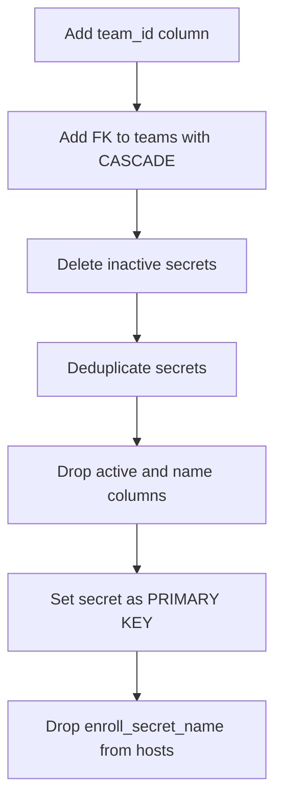

<!-- source-hash: 9ac2441117308bcd94a9da39746e9f64 -->
Database migration that adds team-scoped enrollment secrets support by restructuring the `enroll_secrets` table to associate secrets with teams and simplify the secret model.

## Key Components

- **`Up_20210601000008`** — Idempotent forward migration that:
  - Adds a nullable `team_id` column to `enroll_secrets` with a cascading foreign key to `teams`
  - Removes the `active` concept by deleting inactive secrets
  - Deduplicates secrets sharing the same `secret` value
  - Drops `active` and `name` columns, promoting `secret` to the primary key
  - Drops the now-redundant `enroll_secret_name` column from `hosts`
- **`Down_20210601000008`** — No-op rollback (schema changes are not reversed)

## Migration Flow



## Usage Example

This migration is registered automatically via `init()` and executed by the migration client:

```go
// Registered automatically on package import
MigrationClient.AddMigration(Up_20210601000008, Down_20210601000008)

// The migration client runs Up/Down based on direction:
// db.RunMigrations() -> executes Up_20210601000008(tx)
```

## Notes

- All schema checks use `columnExists` and `fkExists` helpers, making the migration safe to re-run
- Duplicate secrets are resolved by retaining one row per unique `secret` value before applying the primary key constraint
- The rollback is intentionally empty — this migration is considered irreversible

**Source:** [`server/datastore/mysql/migrations/tables/20210601000008_TeamsEnrollSecrets.go`](https://github.com/flamingo-stack/fleetmdm/blob/main/server/datastore/mysql/migrations/tables/20210601000008_TeamsEnrollSecrets.go)