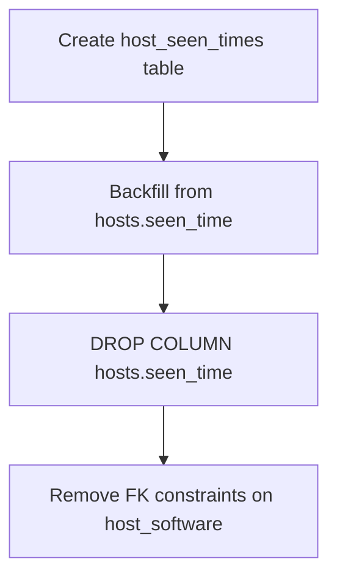

<!-- source-hash: 5fdf935cbb7e81088f266e25ba4f67d6 -->
Database migration that creates a dedicated `host_seen_times` table, decoupling host last-seen timestamps from the `hosts` table to enable bulk updates without table-level locking.

## Key Components

| Symbol | Description |
|---|---|
| `Up_20211102135149` | Forward migration: creates `host_seen_times`, backfills data from `hosts.seen_time`, drops the source column, and removes stale foreign keys on `host_software` |
| `Down_20211102135149` | No-op rollback (intentionally empty) |
| `init()` | Registers both migration functions with `MigrationClient` |

## Migration Steps



1. **Create table** — `host_seen_times(host_id PK, seen_time)` with an index on `seen_time` (idempotent via `CREATE TABLE IF NOT EXISTS`)
2. **Backfill** — `INSERT IGNORE … SELECT` from `hosts` preserves existing data
3. **Drop source column** — guarded by `columnExists` to stay idempotent
4. **Clean up foreign keys** — removes any constraints on `host_software` referencing `hosts` or `software`

## Usage Example

```go
// Migrations run automatically via MigrationClient at startup.
// To apply manually in tests or tooling:
db, _ := sql.Open("mysql", dsn)
tx, _ := db.Begin()
if err := Up_20211102135149(tx); err != nil {
    tx.Rollback()
}
tx.Commit()
```

## Notes

- Addresses [fleet#2776](https://github.com/fleetdm/fleet/issues/2776) — bulk `seen_time` updates previously required locking the entire `hosts` table.
- The rollback is intentionally a no-op; restoring the `seen_time` column to `hosts` after data has been migrated is considered destructive.

**Source:** [`20211102135149_AddHostSeenTimesTable.go`](https://github.com/flamingo-stack/fleetmdm/blob/main/20211102135149_AddHostSeenTimesTable.go)