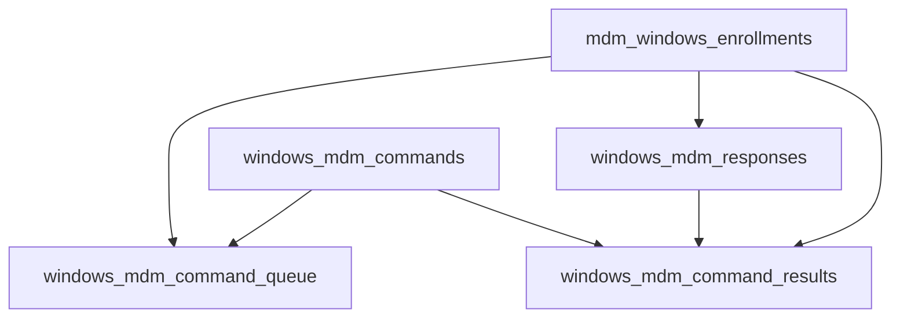

<!-- source-hash: ba1037073d6661e2092f433a8f2beec6 -->
Database migration that creates four MySQL tables supporting Windows MDM (Mobile Device Management) command tracking and response handling in Fleet.

## Key Components

| Function | Description |
|---|---|
| `Up_20231031165350` | Creates four Windows MDM tables (idempotent via `IF NOT EXISTS`) |
| `Down_20231031165350` | No-op rollback (intentionally empty) |

### Tables Created

```text
windows_mdm_commands          — MDM commands with raw XML payload and target OMA-DM URI
windows_mdm_command_queue     — Per-enrollment command queue (FK → enrollments + commands)
windows_mdm_responses         — Raw SyncML response bodies per enrollment
windows_mdm_command_results   — Per-command result/status codes linked to responses
```

**Relationships:**



## Usage Example

This migration runs automatically via the migration client on startup:

```go
// Registered in init() — no manual invocation needed
MigrationClient.AddMigration(Up_20231031165350, Down_20231031165350)
```

To apply manually during development:

```bash
fleet prepare db --config /path/to/config.yml
```

## Notes

- All tables use `utf8mb4_unicode_ci` for full Unicode support.
- Cascade deletes are enforced: removing an enrollment cleans up its queued commands, responses, and results.
- `raw_command` and `raw_response` use `MEDIUMTEXT` to accommodate large SyncML/XML payloads.
- Source: [`server/datastore/mysql/migrations/tables/20231031165350_AddWindowsMDMTables.go`](https://github.com/flamingo-stack/fleetmdm/blob/main/server/datastore/mysql/migrations/tables/20231031165350_AddWindowsMDMTables.go)