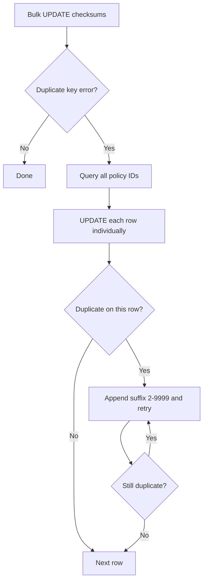

<!-- source-hash: b7820eb1900f8c72ae86d3e8d39f6a3b -->
Database migration that fixes a bug where policy checksums were not being updated, ensuring unique policy name constraints are properly enforced in the `policies` table.

## Key Components

- **`Up_20240221112844`** — Idempotent migration that recalculates MD5 checksums for all existing policy rows using `CONCAT_WS(CHAR(0), team_id, name)`. Handles duplicate name conflicts gracefully by falling back to row-by-row updates with numeric suffixes (e.g., `name2`, `name3`, ...) up to index 9999.
- **`Down_20240221112844`** — No-op rollback; checksum recalculation is safe to leave in place.
- **`isDuplicate`** — Inline helper that inspects MySQL driver errors for `ER_DUP_ENTRY` to detect unique constraint violations.

## Migration Logic



## Usage Example

This migration is registered automatically via `init()` and executed by the migration client:

```go
// Registered automatically — no manual invocation needed.
// The migration client picks up Up/Down via init():
MigrationClient.AddMigration(Up_20240221112844, Down_20240221112844)
```

To run migrations manually in development:

```bash
fleet prepare db --dev
```

## Notes

- The bulk update is attempted first for efficiency; row-by-row fallback only activates when a duplicate name collision exists (expected to be rare).
- If a policy name is already 255 characters or all 9,998 suffix variants are taken, the row is skipped with a warning log and can be corrected when the policy is next modified.

**Source:** [`20240221112844_FixUniquePolicyNameBug.go`](https://github.com/flamingo-stack/fleetmdm/blob/main/db/migrations/tables/20240221112844_FixUniquePolicyNameBug.go)