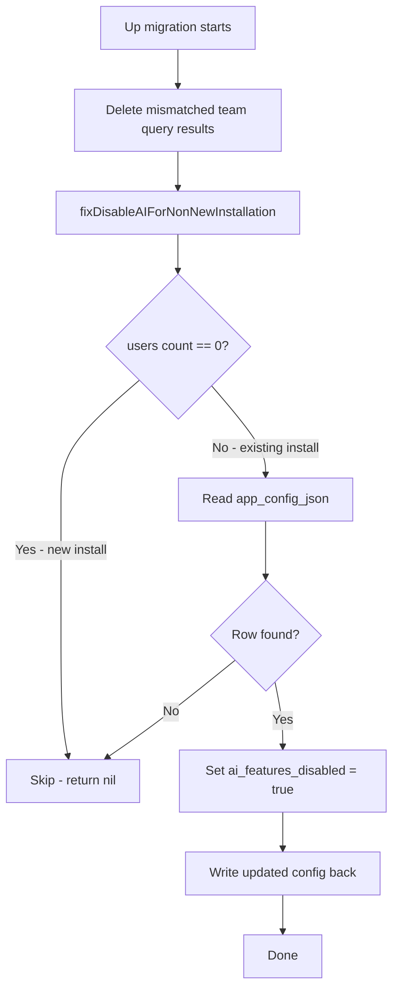

<!-- source-hash: 6c37e01be4d972e6752d0860e3efc43f -->
Database migration that removes mismatched team query results and disables AI features for existing (non-new) Fleet installations upgrading to 4.51.x.

## Key Components

| Function | Description |
|---|---|
| `Up_20240430111727` | Runs two cleanup operations: deletes mismatched team query results, then disables AI features for existing installs |
| `Down_20240430111727` | No-op rollback (migration is intentionally irreversible) |
| `fixDisableAIForNonNewInstallation` | Detects existing installations by user count and sets `ai_features_disabled=true` in `app_config_json` |

## Migration Logic



## Cleanup Operations

**Query Results Cleanup** — Fixes [fleet#18079](https://github.com/fleetdm/fleet/issues/18079). Removes rows from `query_results` where the query belongs to a team that doesn't match the host's team:

```sql
DELETE qr
FROM query_results qr
JOIN queries q ON (q.id=qr.query_id)
JOIN hosts h ON (h.id=qr.host_id)
WHERE q.team_id IS NOT NULL AND q.team_id != COALESCE(h.team_id, 0);
```

**AI Feature Disable** — Introduced as a backport fix for installs upgrading from `< 4.50.0`. Reads `app_config_json`, patches `server_settings.ai_features_disabled = true`, and writes it back only when at least one user exists (indicating an established installation).

## Notes

- **Idempotent** — safe to re-run; the `DELETE` is a no-op if already clean
- New installations (zero users) are skipped by `fixDisableAIForNonNewInstallation`
- `Down_20240430111727` is intentionally empty — deleted rows are not restored