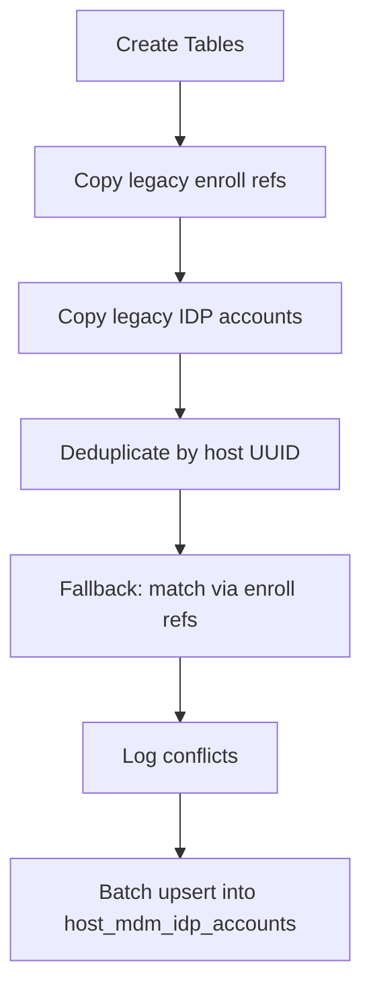

<!-- source-hash: 434dde2af200fd6c4e0db206536dc322 -->
Database migration that creates and populates MDM enrollment tracking tables for Apple device management, migrating legacy enrollment data into a new normalized schema.

## Key Components

| Function | Description |
|---|---|
| `Up_20250502222222` | Creates three new tables and migrates legacy MDM enrollment data |
| `Down_20250502222222` | No-op rollback (returns nil) |

### Tables Created

| Table | Purpose |
|---|---|
| `legacy_host_mdm_enroll_refs` | Archives existing enroll refs from `host_mdm` for legacy Apple device re-enrollment compatibility |
| `legacy_host_mdm_idp_accounts` | Archives host email/IDP account data from `host_emails` for rollback safety |
| `host_mdm_idp_accounts` | New normalized table tracking host-to-IDP-account associations (unique per `host_uuid`) |

## Migration Logic

The `Up` function follows a multi-phase data migration strategy:



**Conflict resolution heuristics:**
- Prefers most recent emails (`ORDER BY email_created_at DESC`)
- Skips records with no matching `mdm_idp_accounts` UUID
- Falls back to matching via `legacy_host_mdm_enroll_refs` → `mdm_idp_accounts` join when email matching fails
- Logs (but does not fail on) conflicting or duplicate account entries

## Usage Example

Applied automatically via the migration client at startup:

```go
// Registered in init()
MigrationClient.AddMigration(Up_20250502222222, Down_20250502222222)
```

> **Note:** The legacy tables (`legacy_host_mdm_enroll_refs`, `legacy_host_mdm_idp_accounts`) are retained for archival and can be dropped once legacy Apple devices are retired and no migration issues are observed.

**Source:** [`20250502222222_AddMdmEnrollTables.go`](https://github.com/flamingo-stack/fleetmdm/blob/main/20250502222222_AddMdmEnrollTables.go)