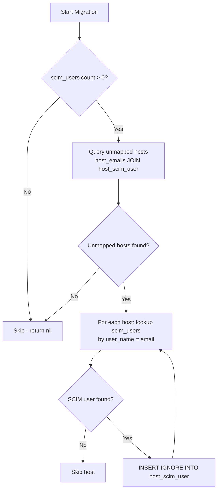

<!-- source-hash: fdff395253ff4b94c1e53f12794ad3c9 -->
Database migration that reconciles missing `host_scim_user` mappings by matching `host_emails` records (sourced from `mdm_idp_accounts`) against existing SCIM users via email/username lookup.

## Key Components

| Symbol | Description |
|---|---|
| `Up_20251028140100` | Forward migration: finds hosts with MDM IdP email records but no SCIM user mapping, then creates the missing `host_scim_user` rows |
| `Down_20251028140100` | No-op rollback — data reconciliation migrations are not reversible |
| `init()` | Registers both migration functions with `MigrationClient` |

## Logic Flow



## Usage Example

This migration runs automatically via the `MigrationClient` during Fleet database upgrades. No manual invocation is needed.

```go
// Registered automatically in init()
MigrationClient.AddMigration(Up_20251028140100, Down_20251028140100)
```

**Idempotency guarantees:**
- Skips entirely if no SCIM users exist
- Uses `INSERT IGNORE` to avoid duplicate mapping errors on re-run
- Skips hosts where no matching SCIM `user_name` is found

## Source

[`20251028140100_ReconcileHostSCIMUserMappings.go`](https://github.com/flamingo-stack/fleetmdm/blob/main/server/datastore/mysql/migrations/tables/20251028140100_ReconcileHostSCIMUserMappings.go)