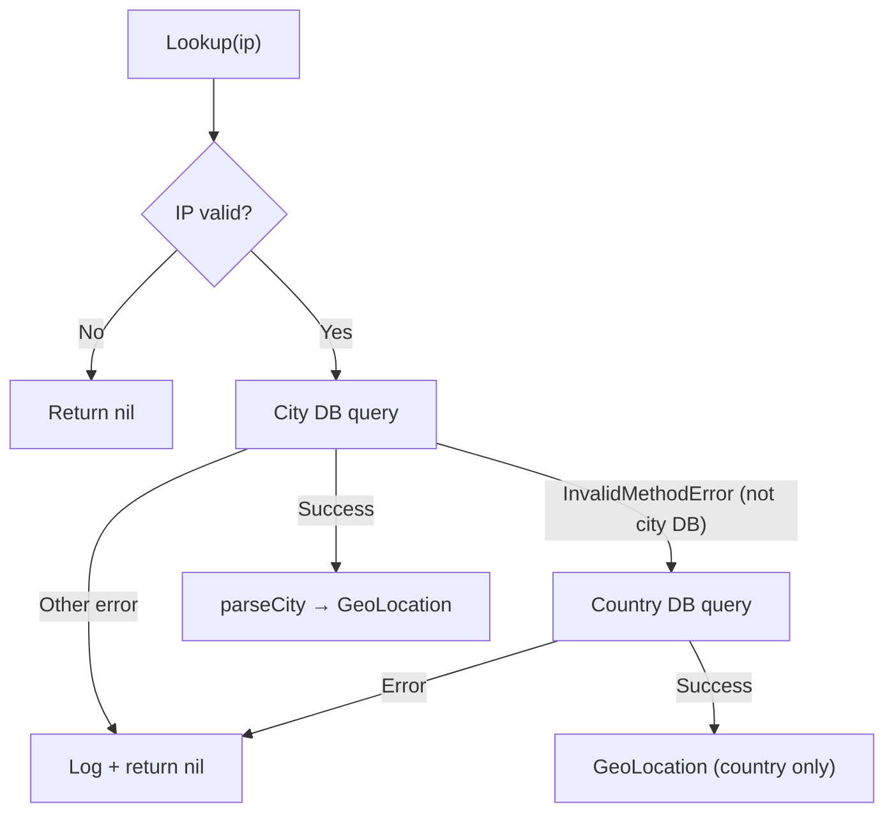

<!-- source-hash: d1beae48e745539280737e2022abd3ee -->
GeoIP lookup abstraction using MaxMind's GeoIP2 database to resolve IP addresses to geographic locations.

## Key Components

- **`GeoLocation`** — Struct holding country ISO code, city name, and optional geometry (lat/lng point)
- **`Geometry`** — GeoJSON-style point geometry with `type` and `coordinates` fields
- **`GeoIP`** — Interface defining the `Lookup(ctx, ip)` contract
- **`MaxMindGeoIP`** — Production implementation backed by a MaxMind `.mmdb` file; attempts City lookup first, falls back to Country-only if the database doesn't support city data
- **`NoOpGeoIP`** — No-op implementation that always returns `nil`; useful for testing or when GeoIP is disabled
- **`NewMaxMindGeoIP`** — Constructor that opens a MaxMind database file
- **`parseCity`** — Internal helper that maps a `geoip2.City` response to a `GeoLocation`

## Usage Example

```go
// Production: open a MaxMind .mmdb file
geoIP, err := fleet.NewMaxMindGeoIP(logger, "/etc/fleet/GeoLite2-City.mmdb")
if err != nil {
    log.Fatal(err)
}

loc := geoIP.Lookup(ctx, "8.8.8.8")
if loc != nil {
    fmt.Println(loc.CountryISO)           // "US"
    fmt.Println(loc.CityName)             // "Mountain View"
    fmt.Println(loc.Geometry.Coordinates) // [37.386, -122.0838]
}

// Testing or GeoIP disabled: use the no-op implementation
var geoIP fleet.GeoIP = &fleet.NoOpGeoIP{}
loc = geoIP.Lookup(ctx, "8.8.8.8") // always nil
```

## Lookup Behavior

The `MaxMindGeoIP.Lookup` method applies a two-step resolution strategy:

