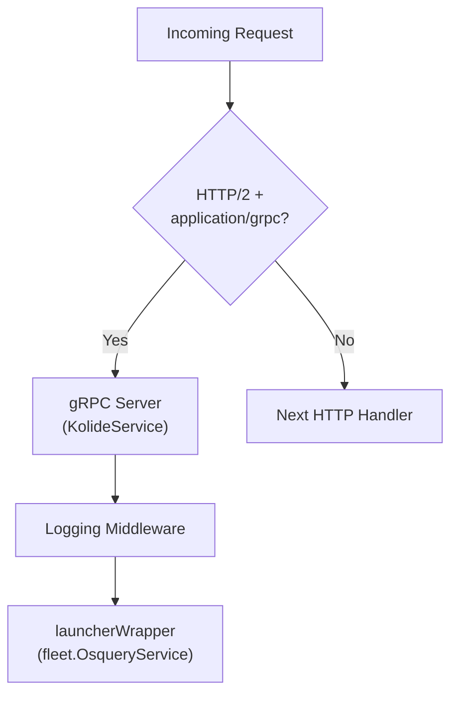

<!-- source-hash: f939434308e5b5bfa4b12ecd5af6d33c -->
Provides a gRPC server implementation for handling remote requests from the Kolide Launcher agent, with support for multiplexing both gRPC and HTTP traffic on a single listener.

## Key Components

| Symbol | Type | Description |
|---|---|---|
| `Handler` | `struct` | Embeds `*grpc.Server` and adds HTTP/gRPC traffic routing |
| `New` | `func` | Constructs and registers a `KolideService`-backed gRPC server with logging middleware |
| `Handler.Handler` | `method` | HTTP middleware that routes `application/grpc` requests to the gRPC server and all other traffic downstream |

## Usage Example

```go
grpcServer := grpc.NewServer()

h := launcher.New(
    osquerySvc,        // fleet.OsqueryService
    logger,            // *slog.Logger
    grpcServer,
    healthCheckers,    // map[string]health.Checker
)

// Wrap your existing HTTP handler to multiplex gRPC + HTTP
http.ListenAndServeTLS(":8080", certFile, keyFile, h.Handler(mux))
```

## Traffic Routing



## Notes

- Uses [`go-kit`](https://github.com/go-kit/kit) transport utilities to populate request context before gRPC dispatch.
- Logging is bridged via `kitlogadapter.NewLogger` to maintain compatibility with the `go-kit` logger interface expected by the Kolide Launcher SDK.
- Health checkers are passed through to `launcherWrapper` for liveness/readiness support.