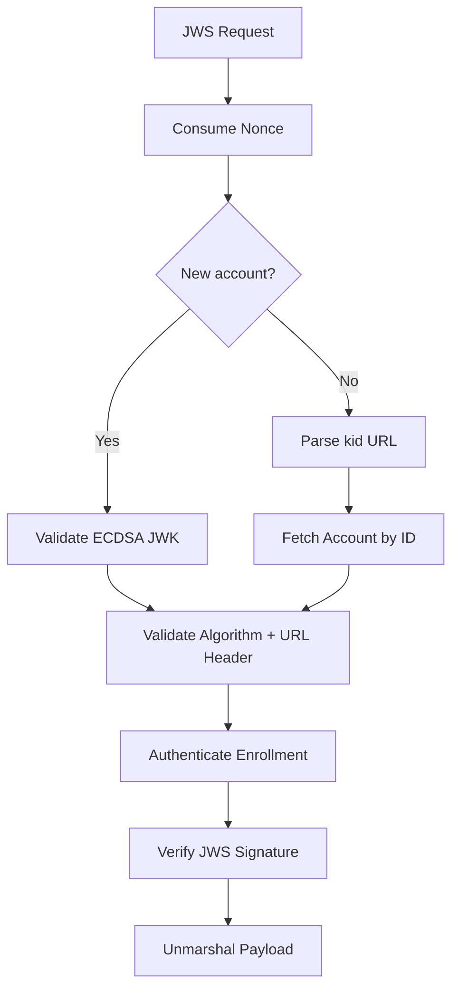

<!-- source-hash: 13166b38425e596dd1a9cf86bbe29083 -->
Handles ACME (Automatic Certificate Management Environment) message authentication for MDM enrollment, validating JWS signatures, nonces, and account identity.

## Key Components

| Name | Type | Description |
|------|------|-------------|
| `acceptableSignatureAlgorithms` | `var` | Allowlist of valid ECDSA signature algorithms (`ES256`, `ES384`, `ES512`) |
| `authenticateWithACMEEnrollment` | `func` | Looks up and validates an ACME enrollment by path identifier |
| `commonAuthenticateMessage` | `func` | Shared authentication logic for both new account and existing account JWS requests |
| `AuthenticateNewAccountMessage` | `func` | Public entry point for authenticating new account creation requests |
| `AuthenticateMessageFromAccount` | `func` | Public entry point for authenticating requests from an existing account |
| `accountIDFromKeyID` | `func` | Parses a numeric account ID out of a `kid` URL (e.g. `.../accounts/42`) |

## Usage Example

```go
// Authenticating a new account message
err := svc.AuthenticateNewAccountMessage(ctx, jwsContainer, &api_http.CreateNewAccountRequest{})
if err != nil {
    // handle ACME error (BadNonce, Unauthorized, MalformedRequest, etc.)
}

// Authenticating a request from an existing account (e.g. order creation)
err := svc.AuthenticateMessageFromAccount(ctx, jwsContainer, orderRequest)
if err != nil {
    // handle error
}
```

## Authentication Flow



> **Note:** Only ECDSA public keys are accepted for new account creation, reflecting Apple ACME's hardware-bound key requirement.