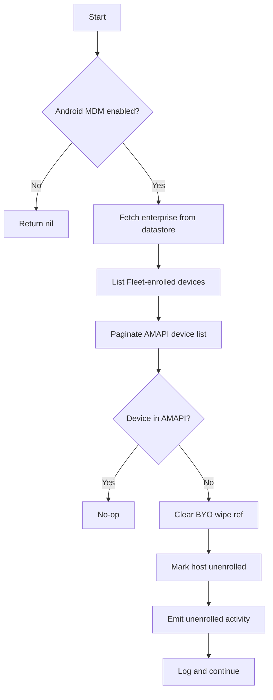

<!-- source-hash: b30cbc8a5c623257bce3aaf889014d86 -->
Reconciles Android MDM enrollment state between Fleet's local datastore and Google's Android Management API (AMAPI), marking devices as unenrolled when they no longer exist in Google.

## Key Components

- **`ReconcileAndroidDevices`** — Main reconciliation function that:
  - Validates Android MDM is enabled and configured
  - Fetches all devices from AMAPI using paginated list calls
  - Compares Fleet-enrolled devices against the AMAPI device set
  - Marks missing devices as unenrolled in Fleet's datastore
  - Emits `ActivityTypeMDMUnenrolled` activity events to mirror Pub/Sub DELETED handling

## Usage Example

```go
err := service.ReconcileAndroidDevices(
    ctx,
    datastore,
    logger,
    licenseKey,
    newActivityFn,
)
if err != nil {
    log.Printf("android reconcile failed: %v", err)
}
```

This function is intended to run as a periodic background job (e.g. a cron task) to catch enrollment state drift that Pub/Sub DELETED events may have missed.

## Flow



## Notes

- Uses a partial AMAPI list call (`EnterprisesDevicesListPartial`) to reduce network and cost overhead — only device names are fetched.
- BYO (Bring Your Own) work-profile wipe references are cleared before flipping enrollment state to ensure the UI "Wiped" badge clears correctly.
- Errors on individual devices are logged and skipped rather than aborting the full reconcile pass.