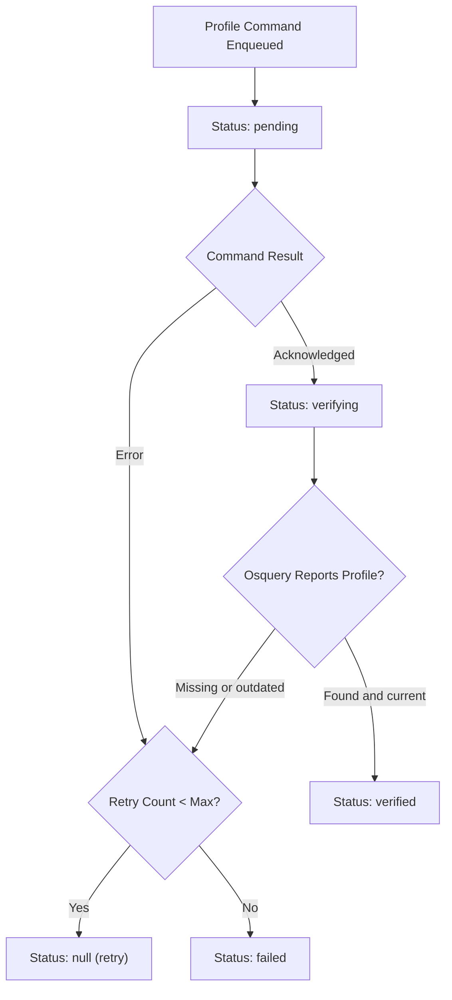

<!-- source-hash: 91c4c344e2d99ecffe449ab57ff73cf7 -->
Handles MDM profile verification for Apple devices in Fleet, providing functions to verify installed profiles against expected configurations and process installation command results.

## Key Components

| Export | Description |
|--------|-------------|
| `VerifyHostMDMProfiles` | Compares installed profiles on a host against expected profiles, categorizing them as verified, retryable, or failed |
| `HandleHostMDMProfileInstallResult` | Processes MDM protocol install command results, handling retries, failures, and enrollment renewal edge cases |

## Verification Status Flow



## Usage Example

```go
// Verify profiles reported by osquery against Fleet expectations
installedProfiles := map[string]*fleet.HostMacOSProfile{
    "com.example.wifi": {
        Identifier:  "com.example.wifi",
        InstallDate: time.Now(),
    },
}

err := apple_mdm.VerifyHostMDMProfiles(ctx, ds, host, installedProfiles)
if err != nil {
    return err
}

// Handle result of an MDM install profile command
status := fleet.MDMDeliveryFailed
err = apple_mdm.HandleHostMDMProfileInstallResult(
    ctx, ds, host.UUID, cmdUUID, &status, "error detail", newActivityFn,
)
```

## Retry Logic

Both functions share the same retry strategy using `mdm.MaxAppleProfileRetries`. Missing or failed profiles below the retry threshold have their status reset to `null`, triggering re-installation on the next cron cycle. Profiles exceeding the threshold are marked `failed`. Enrollment renewal command failures generate a `ActivityTypeFailedEnrollmentProfileRenewal` activity instead of following the standard retry path.