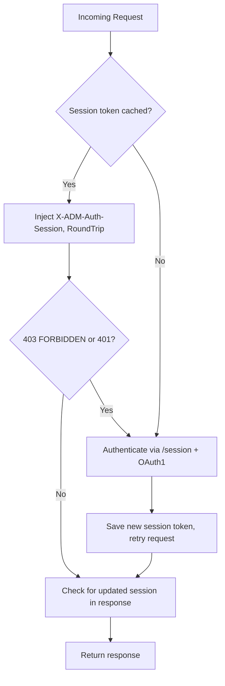

<!-- source-hash: 7d71bc04ba60d34fcdde0acdeb9db3bf -->
Implements an `http.RoundTripper` that transparently handles Apple DEP (Device Enrollment Program) API authentication, OAuth1 session token acquisition, and automatic re-authentication when sessions expire or return forbidden responses.

## Key Components

| Symbol | Type | Description |
|--------|------|-------------|
| `Transport` | `struct` | Core `http.RoundTripper` wrapping authentication and session management |
| `NewTransport` | `func` | Constructor; accepts optional `http.RoundTripper`, `Doer`, `AuthTokensRetriever`, and `SessionStore` |
| `AuthTokensRetriever` | `interface` | Retrieves OAuth1 tokens by DEP name |
| `SessionStore` | `interface` | Gets/sets session tokens keyed by DEP name |
| `sessionMap` | `struct` | Default in-memory, mutex-protected `SessionStore` implementation |
| `WithName` / `GetName` | `func` | Injects/extracts the DEP name into/from a `context.Context` |
| `TeeReadCloser` | `func` | Wraps a `ReadCloser` to buffer the body for potential retry |
| `ErrMissingName` | `error` | Returned when the DEP name is absent from the request context |

## Usage Example

```go
// Implement AuthTokensRetriever to supply OAuth1 credentials
type myTokens struct{}
func (m *myTokens) RetrieveAuthTokens(ctx context.Context, name string) (*client.OAuth1Tokens, error) {
    return &client.OAuth1Tokens{ /* ... */ }, nil
}

transport := client.NewTransport(
    nil,          // defaults to http.DefaultTransport
    nil,          // defaults to http.DefaultClient
    &myTokens{}, // required: OAuth1 token source
    nil,          // defaults to in-memory sessionMap
)

httpClient := &http.Client{Transport: transport}

// DEP name must be in the request context
ctx := client.WithName(context.Background(), "my-dep-server")
req, _ := http.NewRequestWithContext(ctx, "GET", "https://mdmenrollment.apple.com/devices", nil)

resp, err := httpClient.Do(req)
```

## RoundTrip Flow

