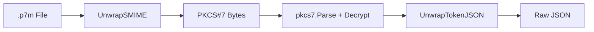

<!-- source-hash: 9303bf88cd457f1ef061e33f58bc3e7d -->
Provides parsing and decryption utilities for Apple ABM/ASM/BE portal token files, handling S/MIME unwrapping and PKCS#7 decryption of `.p7m` token files.

## Key Components

| Function | Description |
|---|---|
| `UnwrapSMIME` | Strips the S/MIME header from a raw `.p7m` file and base64-decodes the CMS/PKCS#7 payload |
| `UnwrapTokenJSON` | Strips S/MIME headers and PEM-like `BEGIN/END MESSAGE` markers from decrypted token data to extract raw JSON |
| `DecryptTokenJSON` | End-to-end pipeline: unwraps S/MIME → parses PKCS#7 → decrypts with cert/key → returns JSON |

## Usage Example

```go
import (
    "crypto/rsa"
    "crypto/x509"
    "os"

    "github.com/flamingo-stack/fleetmdm/ee/dep/tokenpki"
)

// Load your certificate and private key
cert, _ := loadCert("server.crt")
key, _  := loadKey("server.key")

// Read the .p7m token file downloaded from ABM/ASM/BE portal
tokenBytes, err := os.ReadFile("token.p7m")
if err != nil {
    log.Fatal(err)
}

// Decrypt and extract the JSON payload in one step
jsonPayload, err := tokenpki.DecryptTokenJSON(tokenBytes, cert, key)
if err != nil {
    log.Fatal(err)
}

// jsonPayload now contains the raw DEP server token JSON
fmt.Println(string(jsonPayload))
```

## Processing Pipeline



> **Note:** `UnwrapSMIME` and `UnwrapTokenJSON` are also available independently for cases where you need to process intermediate data without full decryption.