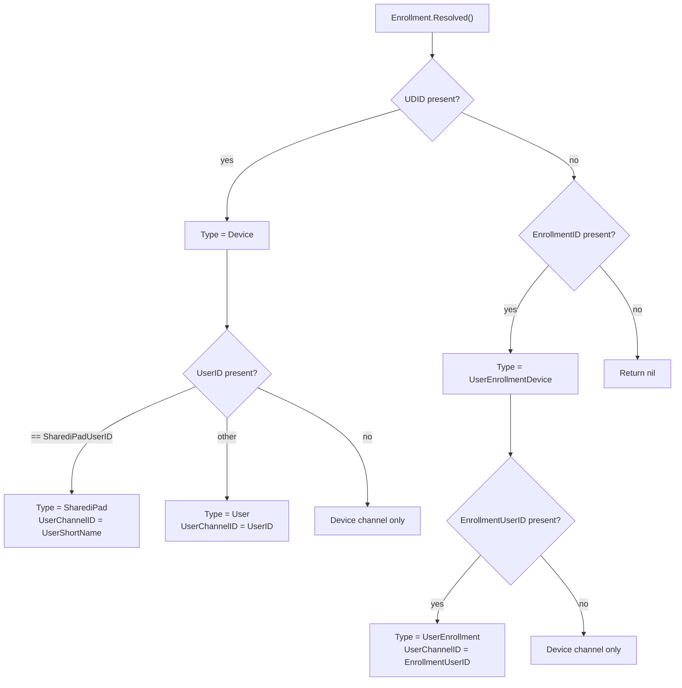

<!-- source-hash: 92d3b166053978ed838f28e458b73bb7 -->
Defines core MDM enrollment types and their resolution logic, mapping raw enrollment data into a normalized `ResolvedEnrollment` structure.

## Key Components

### Constants
- **`SharediPadUserID`** — Static UUID sentinel value (`FFFFFFFF-...`) used by Shared iPad users; triggers fallback to `UserShortName` per MDM spec.

### `EnrollType` (uint)
Enumerated enrollment types:

| Value | Description |
|---|---|
| `Device` | Standard device channel enrollment |
| `User` | User channel via UDID + UserID |
| `UserEnrollmentDevice` | User Enrollment device channel |
| `UserEnrollment` | User Enrollment user channel |
| `SharediPad` | Shared iPad (uses `UserShortName` as channel ID) |

- **`.Valid()`** — Returns `true` if the type is within the defined enum range.
- **`.String()`** — Human-readable representation; returns descriptive fallback for unknown values.

### `ResolvedEnrollment`
A normalized enrollment record with fields:
- `Type` — Resolved `EnrollType`
- `DeviceChannelID` — UDID or EnrollmentID
- `UserChannelID` — UserID, EnrollmentUserID, or UserShortName (Shared iPad)
- `IsUserChannel` — `true` when a user channel is active

- **`.Validate()`** — Checks for nil receiver, empty `DeviceChannelID`, and invalid `Type`.

### `Enrollment.Resolved()`
Converts a raw `Enrollment` into a `*ResolvedEnrollment` using this priority logic:



## Usage Example

```go
enrollment := &mdm.Enrollment{
    UDID:   "device-udid-123",
    UserID: mdm.SharediPadUserID,
    UserShortName: "user@example.com",
}

resolved, err := enrollment.Resolved().Validate()
// resolved.Type        == mdm.SharediPad
// resolved.DeviceChannelID == "device-udid-123"
// resolved.UserChannelID   == "user@example.com"
// resolved.IsUserChannel   == true
```

> **Source:** [`type.go`](https://github.com/flamingo-stack/fleetmdm/blob/main/type.go)