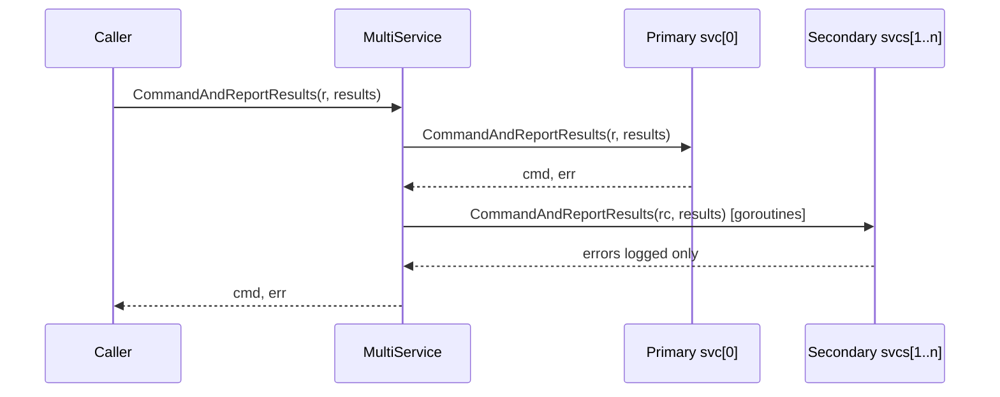

<!-- source-hash: 96f292723a3d7b819e30b6b7b8216259 -->
Implements a multi-service dispatcher that fans out MDM checkin and command calls to multiple `CheckinAndCommandService` implementations, returning results from the first service while running the rest concurrently.

## Key Components

| Symbol | Type | Description |
|--------|------|-------------|
| `MultiService` | struct | Holds an ordered slice of services and a logger; the first service is authoritative |
| `New` | constructor | Creates a `MultiService`; panics if no services are provided |
| `runOthers` | method | Runs all services beyond the first in parallel using a `sync.WaitGroup`, logging errors |
| `RequestWithContext` | method | Clones an `mdm.Request` and attaches the internal background context before passing to secondary services |
| `Authenticate`, `TokenUpdate`, `CheckOut`, `UserAuthenticate`, `SetBootstrapToken`, `GetBootstrapToken`, `DeclarativeManagement`, `GetToken`, `CommandAndReportResults` | methods | Full `CheckinAndCommandService` implementations that delegate to the primary service then fan out |

## Usage Example

```go
import (
    "github.com/fleetdm/fleet/v4/server/mdm/nanomdm/service/multi"
    "github.com/micromdm/nanolib/log"
)

logger := log.NewNopLogger()

// primary drives return values; secondary runs in the background
ms := multi.New(logger, primarySvc, auditSvc, metricsSvc)

// ms now satisfies service.CheckinAndCommandService
cmd, err := ms.CommandAndReportResults(req, results)
```

## Dispatch Pattern



Secondary service errors are logged but never surfaced to the caller. The cloned request passed to secondary services carries a background context, isolating them from caller cancellation.