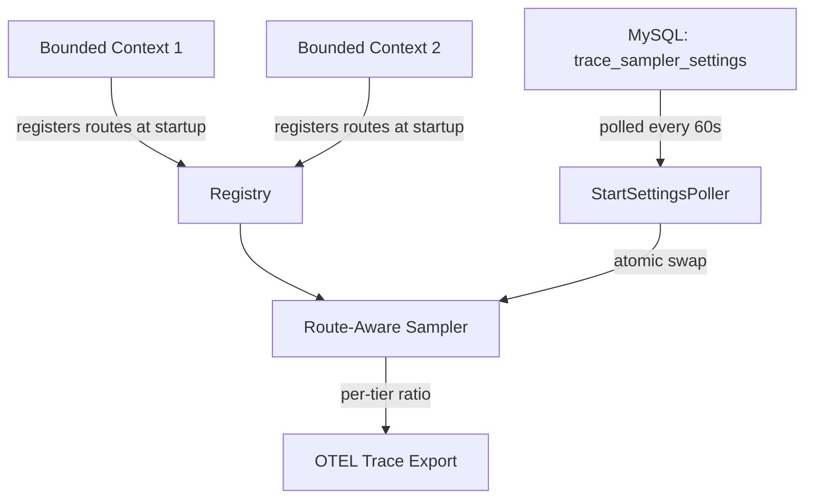

<!-- source-hash: afe20833825029e46a9c03846f4b9b41 -->
Implements a route-aware head sampler for Fleet's OpenTelemetry trace export, classifying spans by tier to prevent high-frequency agent paths from overwhelming critical low-frequency flows.

## Key Components

| Component | Description |
|---|---|
| `Registry` | Stores per-route tier assignments populated by each bounded context at startup |
| `Sampler` | Applies per-tier ratio sampling using the Registry to classify incoming spans |
| `Tier` (enum) | Categorizes routes by traffic importance (e.g., hot agent paths vs. enroll/MDM/cron) |
| `StartSettingsPoller` | Background goroutine that re-reads `trace_sampler_settings` from MySQL every 60 seconds and atomically swaps sampler state |

## Architecture



## Usage Example

```go
// Each bounded context registers its routes at startup
registry := tracing.NewRegistry()
registry.Register("/api/v1/enroll", tracing.TierCritical)
registry.Register("/api/v1/agent/check-in", tracing.TierHot)

sampler := tracing.NewSampler(registry)

// Start polling MySQL for runtime control (no restart needed)
tracing.StartSettingsPoller(ctx, db, sampler)
```

## Design Notes

- **Cross-context isolation:** `platform/tracing` owns only the mechanism; each bounded context owns its own tier policy, keeping the package free of cross-context coupling.
- **Runtime control:** Flip `force_full` in `trace_sampler_settings` during an incident debug window without restarting any Fleet replica.

---

📁 [`platform/tracing/doc.go`](https://github.com/flamingo-stack/fleetmdm/blob/main/platform/tracing/doc.go)