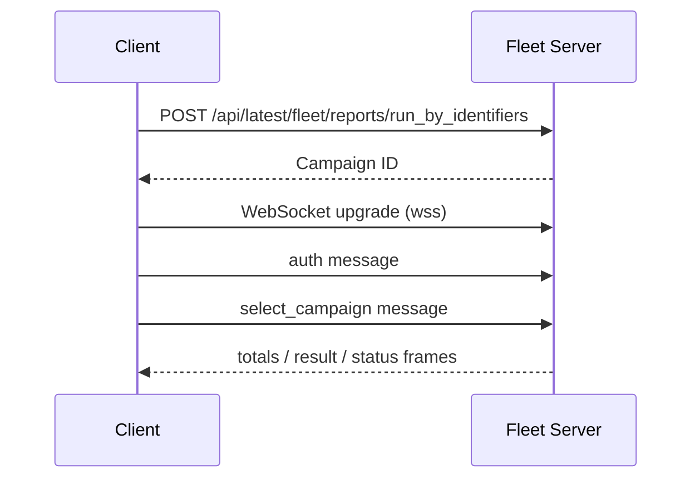

<!-- source-hash: 33954bdfb505fdc4f899d22106afe3ef -->
Manages the client-side live query WebSocket connection, enabling real-time streaming of distributed query results from the Fleet server.

## Key Components

### `LiveQueryResultsHandler`
A struct that holds channels and atomic values for consuming live query results:
- `Errors() <-chan error` — channel for server/connection errors
- `Results() <-chan fleet.DistributedQueryResult` — channel for incoming query results
- `Totals() *targetTotals` — current host targeting metadata
- `Status() *campaignStatus` — current campaign status

### `Client` Methods
- `LiveQuery(query, queryID, labels, hostIdentifiers)` — creates a live query campaign and opens a WebSocket stream (uses `context.Background()`)
- `LiveQueryWithContext(ctx, query, queryID, labels, hostIdentifiers)` — context-aware variant; POSTs to `/api/latest/fleet/reports/run_by_identifiers`, upgrades to a `wss://` WebSocket, authenticates, selects the campaign, then fans out incoming messages in a background goroutine

## Usage Example

```go
handler, err := client.LiveQuery("SELECT * FROM osquery_info", nil, nil, []string{"host1.example.com"})
if err != nil {
    log.Fatal(err)
}

for {
    select {
    case res := <-handler.Results():
        fmt.Printf("Result from %s: %v\n", res.Host.Hostname, res.Rows)
    case err := <-handler.Errors():
        log.Printf("Error: %v\n", err)
    }
}
```

## Message Flow



> **Note:** In test environments (`test.v` flag present), the scheme falls back to `ws` instead of `wss`.

**Source:** [`server/service/client_live_query.go`](https://github.com/flamingo-stack/fleetmdm/blob/main/server/service/client_live_query.go)