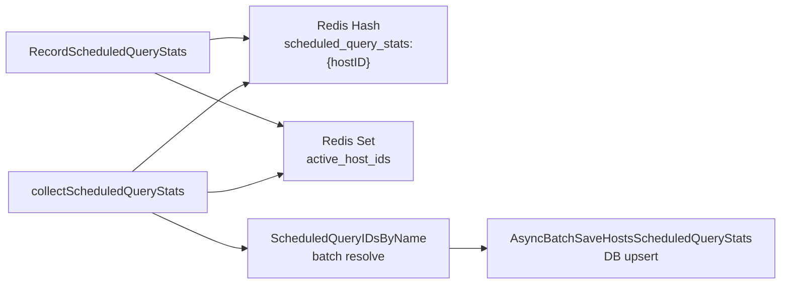

<!-- source-hash: 53f8dd230a3e3ede781a3c07220ae744 -->
Handles asynchronous recording and collection of scheduled query statistics for Fleet hosts, buffering stats in Redis before batch-writing them to the datastore.

## Key Components

| Symbol | Type | Description |
|--------|------|-------------|
| `scheduledQueryStatsHostQueriesKey` | `const` | Redis hash key template (`scheduled_query_stats:{hostID}`) storing per-host query stats |
| `scheduledQueryStatsHostIDsKey` | `const` | Redis sorted-set key tracking all active host IDs with pending stats |
| `scheduledQueryStatsKeyMinTTL` | `const` | Minimum TTL for Redis keys (7 days); extended to `10 × CollectInterval` if larger |
| `RecordScheduledQueryStats` | `func` | Writes incoming `PackStats` into a Redis hash keyed by `packName\x00queryName`; falls back to direct DB write when async is disabled |
| `collectScheduledQueryStats` | `func` | Collector that drains Redis hashes for all active hosts, resolves scheduled query IDs in bulk, and upserts stats via `AsyncBatchSaveHostsScheduledQueryStats` |

## Usage Example

```go
// Recording stats (called per host check-in)
err := task.RecordScheduledQueryStats(ctx, teamID, hostID, packStats, time.Now())

// Collection runs on a background ticker managed by the Task scheduler.
// Internally it:
//   1. Loads active host IDs from the Redis sorted set.
//   2. HSCANs each host's hash to read pack/query stats.
//   3. Batch-resolves scheduled query IDs from names.
//   4. Upserts resolved stats to the datastore.
//   5. Removes processed host IDs from the active set.
```

## Data Flow



> **Redis Cluster note:** The active host IDs set and per-host hashes may reside on different cluster nodes; `storePurgeActiveHostID` and hash operations are executed on separate connections via `BindConn`.

**Source:** [`server/service/async/async_scheduled_query_stats.go`](https://github.com/flamingo-stack/fleetmdm/blob/main/server/service/async/async_scheduled_query_stats.go)