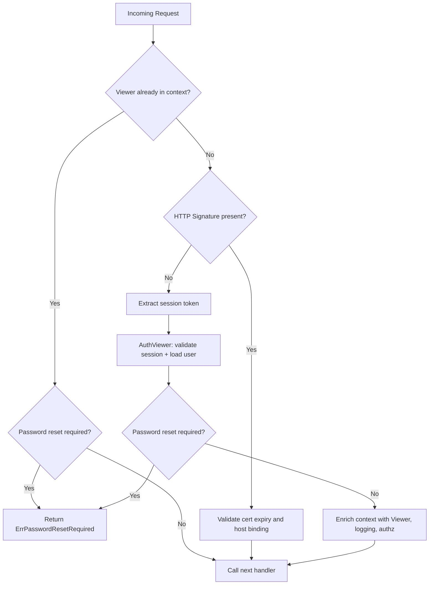

<!-- source-hash: ab0ffc2fc3ef826ef96408da0fc45a64 -->
Provides authentication middleware and viewer initialization utilities for Fleet API endpoints, supporting both session token and HTTP message signature authentication methods.

## Key Components

| Export | Type | Description |
|--------|------|-------------|
| `AuthViewer` | `func` | Validates a session key and returns an authenticated `viewer.Viewer` containing the resolved user and session |
| `AuthenticatedUser` | `func` | go-kit endpoint middleware that enforces authentication, supports HTTP signature auth for host identity, and populates the context with a `Viewer` |
| `UnauthenticatedRequest` | `func` | go-kit endpoint wrapper that bypasses auth but still applies request logging |
| `AuthenticatedUserMiddleware` | `func` | Standard `http.Handler` middleware equivalent of `AuthenticatedUser`, for use outside the go-kit transport layer |

## Authentication Flow



## Usage Example

```go
// Wrap a go-kit endpoint with user authentication
authenticatedEndpoint := auth.AuthenticatedUser(svc, myEndpoint)

// Wrap a standard http.Handler (e.g. for file downloads or webhooks)
http.Handle("/api/v1/resource", auth.AuthenticatedUserMiddleware(
    svc,
    func(w http.ResponseWriter, detail string, status int) {
        http.Error(w, detail, status)
    },
    myHandler,
))

// Manually resolve a viewer from a raw session key
v, err := auth.AuthViewer(ctx, sessionKey, svc)
if err != nil {
    // returns fleet.AuthRequiredError on failure
}
```