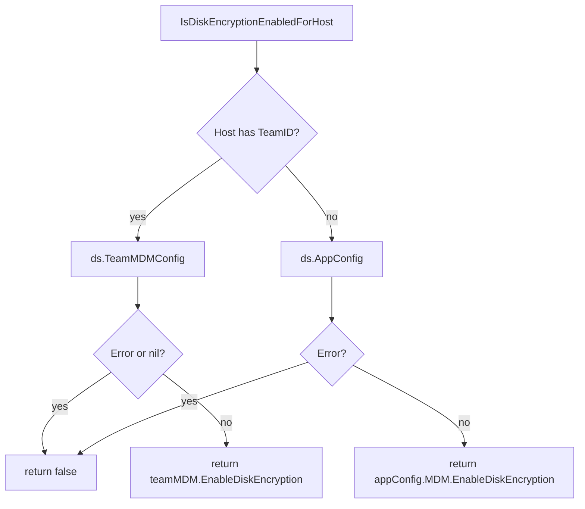

<!-- source-hash: 2fbf85cf1ec0debc16eea5d6ead3d972 -->
Helper function that checks whether disk encryption is enabled for a given host, resolving the setting from the host's team MDM configuration or falling back to the global app configuration.

## Key Components

- **`IsDiskEncryptionEnabledForHost`** — Determines if disk encryption is enabled for a host by checking team-level MDM config when the host belongs to a team, or the global `AppConfig` MDM setting otherwise. Returns `false` on any datastore error.

## Usage Example

```go
enabled := osquery_utils.IsDiskEncryptionEnabledForHost(ctx, logger, ds, host)
if enabled {
    // enforce or report disk encryption compliance
}
```

## Lookup Logic



## Notes

- Errors from the datastore are logged at `DEBUG` level and cause a safe `false` return rather than propagating the error.
- Lives in the `osquery_utils` package alongside other host inspection utilities.

**Source:** [`disk_encryption_helpers.go`](https://github.com/flamingo-stack/fleetmdm/blob/main/disk_encryption_helpers.go)