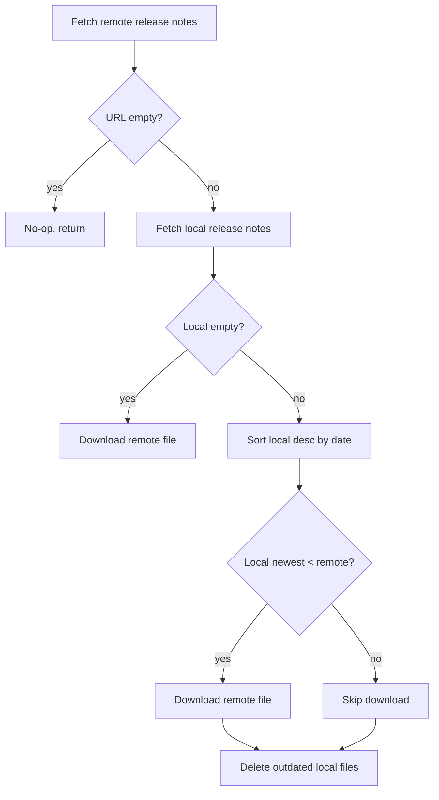

<!-- source-hash: 5ff40ebd86e354ff7a47f1e29b117a8b -->
Synchronizes local Mac Office release notes metadata with the latest version published on GitHub, downloading updates and removing outdated local files as needed.

## Key Components

- **`SyncFromGithub(ctx, dstDir)`** — Public entry point that initializes GitHub and filesystem clients, then delegates to `sync` to keep local metadata current.
- **`sync(ctx, fsClient, ghClient)`** — Core logic that compares the remote release date against local files, downloads newer versions, and deletes stale entries.

## Usage Example

```go
err := macoffice.SyncFromGithub(ctx, "/var/fleet/vulnerabilities")
if err != nil {
    log.Fatalf("failed to sync mac office release notes: %v", err)
}
```

## Sync Logic



## Notes

- Local files are sorted descending so the most recent is compared first against the remote version.
- Any local file with a date **before** the remote release is deleted, preventing accumulation of stale metadata.
- Depends on [`io.GitHubAPI`](https://github.com/flamingo-stack/fleetmdm/blob/main/server/vulnerabilities/io) and [`io.FSAPI`](https://github.com/flamingo-stack/fleetmdm/blob/main/server/vulnerabilities/io) interfaces, making the sync logic independently testable.