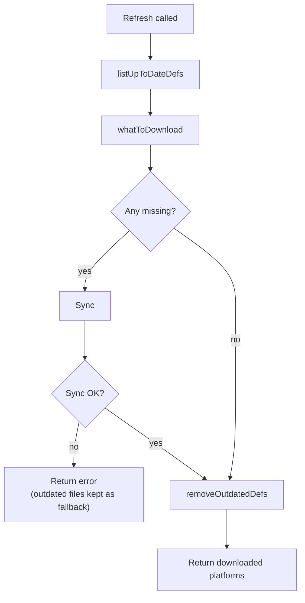

<!-- source-hash: 613ad7fbe5b33562b6f99af9f051ef75 -->
Manages synchronization and refresh of OVAL (Open Vulnerability and Assessment Language) definition files for vulnerability scanning, handling download, decompression, and lifecycle management of platform-specific JSON definition artifacts.

## Key Components

| Function | Description |
|---|---|
| `ghNvdFileGetter()` | Returns a closure that downloads files from the `fleetdm/nvd` GitHub repository using an authenticated client |
| `downloadDecompressed()` | Returns a closure that downloads and extracts a compressed file from a URL to a destination path |
| `whatToDownload()` | Compares current OS versions against existing local definitions to determine which platforms need new downloads |
| `listUpToDateDefs()` | Walks a directory and returns a set of OVAL filenames matching today's date, without deleting any files |
| `removeOutdatedDefs()` | Removes OVAL definition files that do not match the given date; called only after a successful sync |
| `removeOldDefs()` | Combined list-and-remove operation retained for backwards compatibility with existing tests |
| `Sync()` | Downloads and parses OVAL definitions for one or more platforms, converting XML source files to JSON |
| `Refresh()` | Orchestrates the full refresh cycle — lists existing definitions, syncs missing ones, then removes outdated files only on success |

## Usage Example

```go
// Refresh OVAL definitions for all active OS versions
downloaded, err := oval.Refresh(ctx, osVersions, "/var/fleet/vuln")
if err != nil {
    log.Fatalf("oval refresh failed: %v", err)
}
fmt.Printf("Downloaded %d new platform definitions\n", len(downloaded))

// Sync specific platforms directly
platforms := []oval.Platform{
    oval.NewPlatform("ubuntu", "Ubuntu 22.04"),
}
if err := oval.Sync("/var/fleet/vuln", platforms); err != nil {
    log.Fatalf("oval sync failed: %v", err)
}
```

## Refresh Lifecycle



## Source

[`sync.go`](https://github.com/flamingo-stack/fleetmdm/blob/main/sync.go)