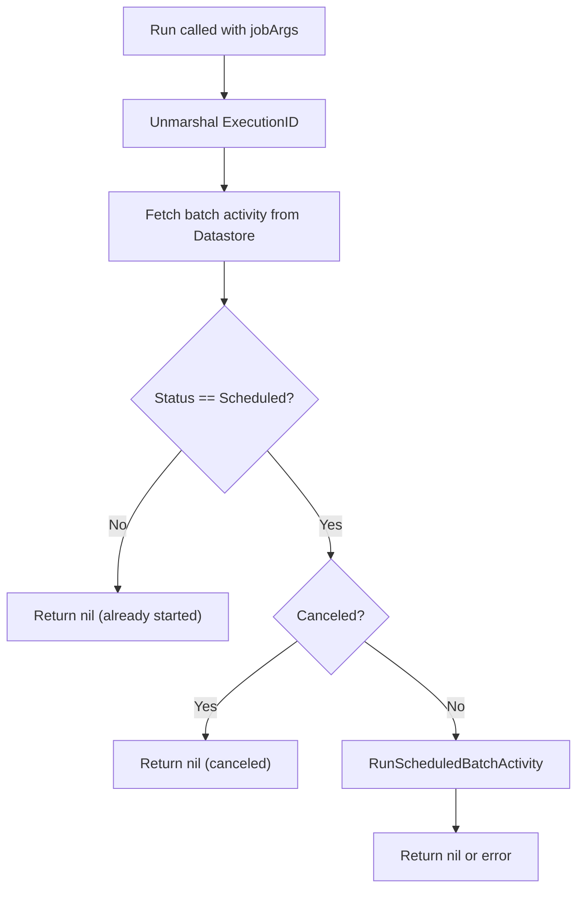

<!-- source-hash: fdd6cd4fbe617323e2a03132cb49447e -->
Implements a worker job that processes scheduled batch script activities, triggering execution of a queued batch via the Fleet datastore.

## Key Components

| Name | Type | Description |
|------|------|-------------|
| `BatchScripts` | struct | Worker job handler holding a `fleet.Datastore` and a `*slog.Logger` |
| `Name()` | method | Returns `fleet.BatchActivityScriptsJobName` to identify this job type |
| `Run()` | method | Unmarshals job args, validates activity state, and triggers batch script execution |

## Usage Example

```go
batchWorker := &worker.BatchScripts{
    Datastore: ds,
    Log:       slog.Default(),
}

// Register with the worker queue
workerQueue.AddJob(batchWorker)
```

### Execution Flow



## Notes

- The job is a no-op if the activity has already been started (status is not `ScheduledBatchExecutionScheduled`) or has been canceled, preventing duplicate execution.
- Errors are wrapped with context using `ctxerr.Wrap` for structured error propagation.

## Source

[`batch_activities.go`](https://github.com/flamingo-stack/fleetmdm/blob/main/batch_activities.go)