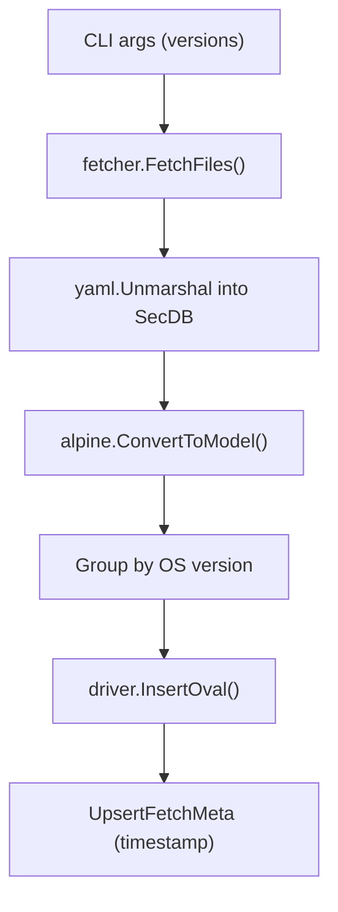

<!-- source-hash: a80cea318d9c411e75cf8f700ceb6960 -->
Fetches Alpine Linux security vulnerability data from [Alpine SecDB](https://secdb.alpinelinux.org/) and stores it in the local OVAL dictionary database.

## Key Components

| Component | Description |
|-----------|-------------|
| `fetchAlpineCmd` | Cobra subcommand (`fetch alpine`) accepting one or more Alpine version strings |
| `fetchAlpine()` | Core handler: initializes logging, opens DB, fetches SecDB YAML files, parses them, and upserts definitions |
| `alpine.ConvertToModel()` | Converts parsed `SecDB` YAML structs into `models.Definition` slices |
| `fetcher.FetchFiles()` | Retrieves raw YAML files from Alpine SecDB for the specified versions |

## Usage Example

```bash
# Fetch vulnerability data for Alpine 3.16 and 3.17
goval-dictionary fetch alpine 3.16 3.17
```

## Pipeline Flow



## Notes

- Requires at least one Alpine version argument (`cobra.MinimumNArgs(1)`)
- Deduplicates version arguments via `util.Unique()` before fetching
- Validates DB schema version via `fetchMeta.OutDated()` before writing; aborts if schema is stale
- Configured via Viper flags: `dbtype`, `dbpath`, `debug-sql`, `log-to-file`, `log-dir`, `debug`, `log-json`
- Source: [`fetch-alpine.go`](https://github.com/flamingo-stack/fleetmdm/blob/main/fetch-alpine.go)