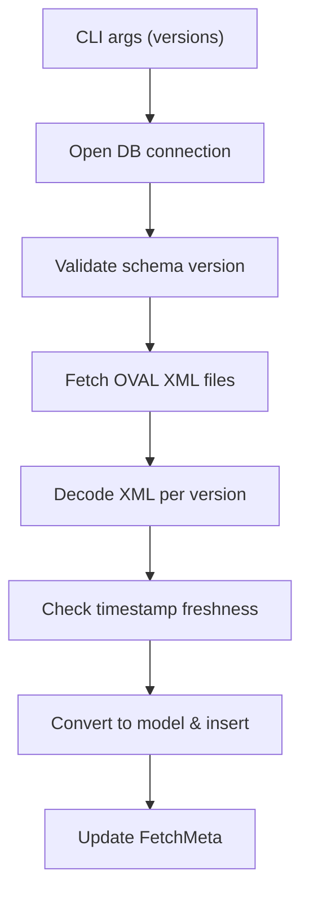

<!-- source-hash: 9efa324a1a22b75a954b2d9f588e64c0 -->
Implements the `fetch debian` subcommand for retrieving and storing Debian OVAL (Open Vulnerability and Assessment Language) vulnerability data into the local database.

## Key Components

- **`fetchDebianCmd`** — Cobra command registered under `fetch debian`, accepting one or more Debian version numbers (e.g., `10`, `11`) as arguments
- **`fetchDebian`** — Core handler that orchestrates the full fetch pipeline: opens the DB, validates schema version, fetches remote OVAL XML files, parses them, and inserts results

## Usage Example

```bash
# Fetch OVAL data for Debian 10 and 11
$ goval-dictionary fetch debian 10 11
```

```go
// The command is registered automatically via init()
func init() {
    fetchCmd.AddCommand(fetchDebianCmd)
}
```

## Flow



## Notes

- Deduplicates version arguments via `util.Unique` before fetching
- Uses `charset.NewReaderLabel` to handle non-UTF-8 XML encodings
- Emits a warning if the fetched OVAL data has not been updated in the last 3 days, suggesting the upstream URL may have changed
- Schema version is upserted before fetching to ensure DB consistency on partial failures