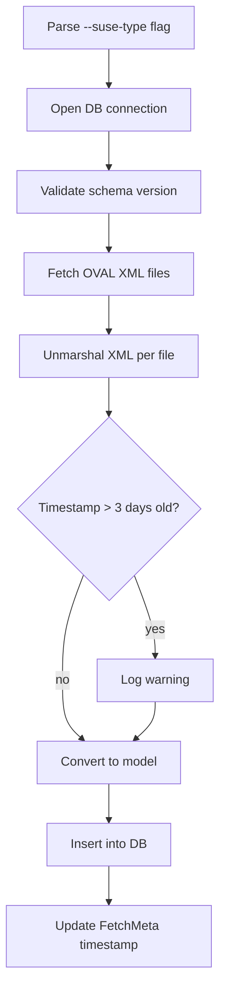

<!-- source-hash: d8b8ecd069192f821b972f1111543f47 -->
Fetches and stores SUSE OVAL vulnerability data into the local database, supporting multiple SUSE distribution types via a Cobra subcommand.

## Key Components

- **`fetchSUSECmd`** — Cobra command registered under `fetch suse`, accepts version arguments and a `--suse-type` flag
- **`init()`** — Registers the command and binds the `--suse-type` persistent flag (default: `opensuse-leap`) via Viper
- **`fetchSUSE()`** — Core handler that orchestrates OVAL fetching, XML parsing, model conversion, and database insertion

### Supported SUSE Types

| Flag Value | Config Constant |
|---|---|
| `opensuse` | `c.OpenSUSE` |
| `opensuse-leap` | `c.OpenSUSELeap` |
| `suse-enterprise-server` | `c.SUSEEnterpriseServer` |
| `suse-enterprise-desktop` | `c.SUSEEnterpriseDesktop` |

## Usage Example

```bash
# Fetch OpenSUSE Leap versions 15.2 and 15.3
goval-dictionary fetch suse --suse-type opensuse-leap 15.2 15.3

# Fetch SUSE Enterprise Server versions 12 and 15
goval-dictionary fetch suse --suse-type suse-enterprise-server 12 15

# Fetch OpenSUSE including Tumbleweed
goval-dictionary fetch suse --suse-type opensuse 13.2 tumbleweed
```

## Flow



> **Note:** If a fetched OVAL file has not been updated in over 3 days, a warning is logged suggesting the OVAL URL may have changed.