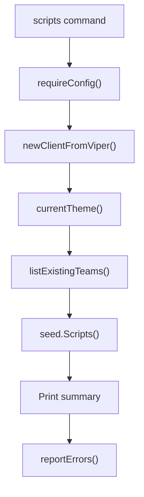

<!-- source-hash: dbd5fcda93f851400978f132ce6f34b3 -->
Registers the `scripts` CLI subcommand for seeding saved shell scripts (`.sh`, `.ps1`, `.zsh`) into a Fleet instance via the `dibble` seed tool.

## Key Components

- **`newScriptsCmd()`** — Constructs and returns a `*cobra.Command` that seeds scripts globally and per-team. It validates configuration, initializes a Fleet API client, resolves the active theme, retrieves existing teams, and delegates to `seed.Scripts`.

## Usage Example

```bash
# Seed default 3 global scripts (plus 1 per team)
dibble scripts

# Seed a custom number of global scripts
dibble scripts --count 10
```

## Flags

| Flag | Default | Description |
|------|---------|-------------|
| `--count` | `3` | Number of global scripts to seed; additionally seeds 1 script per existing team |

## Flow



## Notes

- Relies on shared helpers (`requireConfig`, `newClientFromViper`, `currentTheme`, `listExistingTeams`) defined elsewhere in the `command` package.
- Output includes a human-readable summary and surfaces any seeding errors via `reportErrors`.
- Source: [`scripts.go`](https://github.com/flamingo-stack/fleetmdm/blob/main/tools/dibble/pkg/command/scripts.go)