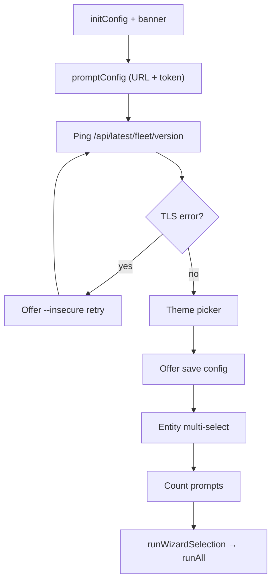

<!-- source-hash: 0d11196614595c69c40abd8ed30b4fdc -->
Provides the interactive no-argument wizard flow for the `dibble` CLI tool, guiding users through Fleet server configuration, entity selection, and seed count setup via terminal prompts.

## Key Components

| Symbol | Description |
|---|---|
| `runWizard(root *cobra.Command) error` | Main entry point that orchestrates the 7-step interactive wizard flow |
| `promptConfig() (bool, bool, error)` | Prompts for missing Fleet URL and API token, returning flags indicating what was asked |
| `writeConfigFile() error` | Persists managed config keys (URL, token, theme, insecure) to YAML, merging with any existing file |
| `promptCounts(wanted map[string]bool, defaults allCounts) allCounts` | Interactively prompts for per-entity seed counts for selected entities only |
| `isTLSVerificationError(err error) bool` | Detects untrusted TLS certificate errors to enable the `--insecure` recovery prompt |
| `runWizardSelection(...)` | Zeroes out unselected entities in `allCounts` before delegating to `runAll` |

## Wizard Flow



## Usage Example

```go
// Invoked automatically when dibble is run with no arguments
rootCmd.RunE = func(cmd *cobra.Command, args []string) error {
    if len(args) == 0 {
        return runWizard(cmd)
    }
    return nil
}
```

> **Note:** The `vulns` entity is intentionally excluded from the wizard — it requires direct MySQL access via `--dsn` and must be run as a dedicated subcommand: `dibble vulns --dsn ... --macos N --ubuntu N --windows N`.