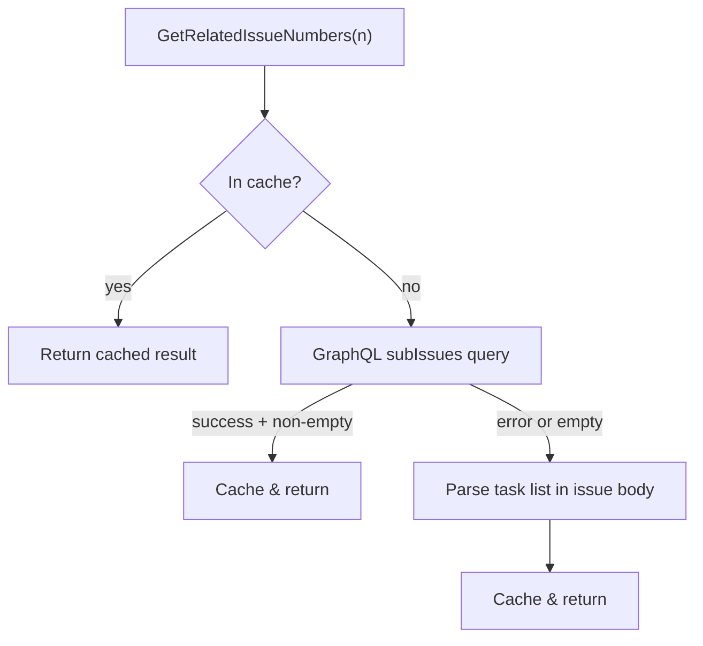

<!-- source-hash: befb3b5b9d07eb1c7af1f061b9a2be43 -->
Discovers related (child) issues for a given GitHub issue number using a two-stage lookup: GitHub GraphQL sub-issues API first, with a fallback to parsing Markdown task list references in the issue body.

## Key Components

| Symbol | Description |
|---|---|
| `GetRelatedIssueNumbers(issueNumber int)` | Primary exported function; returns child issue numbers with in-memory caching |
| `getSubIssuesViaGraphQL(issueNumber int)` | Queries the GitHub GraphQL `subIssues` field (official hierarchy feature) |
| `getTaskListIssueRefs(issueNumber int)` | Fallback parser; extracts `- [ ] #NNN` / `- [x] #NNN` task list refs from the issue body |
| `getRepoOwnerAndName()` | Resolves the current repo's owner/name via `gh repo view`, cached after first call |
| `relatedIssuesCache` | Thread-safe `sync.RWMutex`-guarded map caching results per issue number |
| `repoOwnerNameCache` | Thread-safe `sync.Mutex`-guarded struct caching owner and repo name |

## Usage Example

```go
// Discover child issues for issue #42
children, err := ghapi.GetRelatedIssueNumbers(42)
if err != nil {
    log.Fatalf("failed to get related issues: %v", err)
}

fmt.Printf("Issue #42 has %d related sub-issues: %v\n", len(children), children)
// Output: Issue #42 has 3 related sub-issues: [43 44 45]
```

## Lookup Strategy



## Notes

- **Cache invalidation:** Both caches are process-lifetime; restart the process to clear stale entries.
- **Directionality:** Only _downward_ (parent → children) links are resolved. Scanning other issues' bodies to infer parents is not implemented due to cost.
- **Deduplication:** Both lookup paths deduplicate results and exclude self-references (`num == issueNumber`).