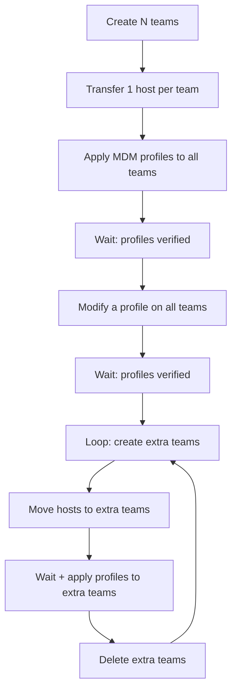

<!-- source-hash: 7cb603b71b42d49a14c1a2154250d16b -->
A load testing script that automates Fleet MDM team and profile management operations to benchmark performance at scale, implementing the test plan defined in [fleet#11531](https://github.com/fleetdm/fleet/issues/11531).

## Key Components

- **`main()`** — Orchestrates the full load test sequence across numbered steps (1–8), with interactive prompts between phases and elapsed time reporting for each step
- **`printfAndPrompt()`** — Prints a timestamped message and pauses for user confirmation before continuing
- **`printf()`** — Prints a UTC-timestamped log message
- **`waitProfilesAppliedOnTeams()`** — Polls MDM profile summary until all hosts in all given teams reach `Verifying` state, sleeping 5 seconds between checks
- **`profiles`** — Hardcoded slice of macOS MDM configuration profiles (Apple plist XML) used during the test
- **`newProfile`** — A replacement profile added during the "modify profile" step

## Usage Example

```bash
# Run the full load test
go run loadtest.go \
  -fleet_url=https://fleet.example.com \
  -api_token=your_api_token \
  -team_count=10 \
  -team_extra_count=5 \
  -loop_count=3

# Clean up teams from a previous run
go run loadtest.go \
  -fleet_url=https://fleet.example.com \
  -api_token=your_api_token \
  -cleanup_teams
```

## CLI Flags

| Flag | Required | Description |
|------|----------|-------------|
| `-fleet_url` | ✅ | Fleet server URL with protocol and port |
| `-api_token` | ✅ | API authentication token |
| `-team_count` | ✅* | Number of base teams to create |
| `-team_extra_count` | ✅* | Number of extra teams per loop iteration |
| `-loop_count` | No | Iterations of the extra-team cycle (default: `1`) |
| `-cleanup_teams` | No | Delete all teams from a prior run and exit |

> \* Required unless `-cleanup_teams` is set.

## Test Flow

