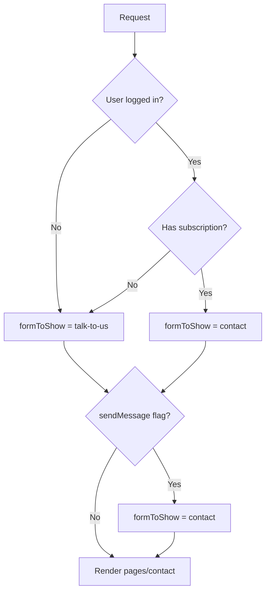

<!-- source-hash: 04f0ce3fa08eb8360e68e7baf3b9d548 -->
Renders the Contact page by determining which contact form variant to display based on the user's authentication status and subscription level.

## Key Components

- **`sendMessage`** *(input)*: Boolean flag that forces the `contact` form to display when `true`, regardless of subscription status
- **`formToShow`**: Derived string value (`'talk-to-us'` or `'contact'`) controlling which form variant is rendered
- **`userHasPremiumSubscription`**: Resolved by querying the `Subscription` model for the current user
- **`currentOpenPositionsForApplicationDropdown`**: Plucked job titles from `sails.config.builtStaticContent.openPositions` for populating a careers dropdown
- **`badConfig` exit**: Thrown when `builtStaticContent.openPositions` is missing or malformed

## Logic Flow



## Usage Example

```javascript
// Navigating directly to the contact page (unauthenticated)
// GET /contact
// → formToShow: 'talk-to-us'

// Forcing the contact form via query param (e.g. from a CTA button)
// GET /contact?sendMessage=true
// → formToShow: 'contact'

// Authenticated user with an active subscription
// GET /contact
// → formToShow: 'contact', userHasPremiumSubscription: true
```

## Notes

- Requires `sails.config.builtStaticContent.openPositions` to be a populated array; throws `badConfig` otherwise
- View template resolves to [`pages/contact`](https://github.com/flamingo-stack/fleetmdm/blob/main/views/pages/contact.ejs)