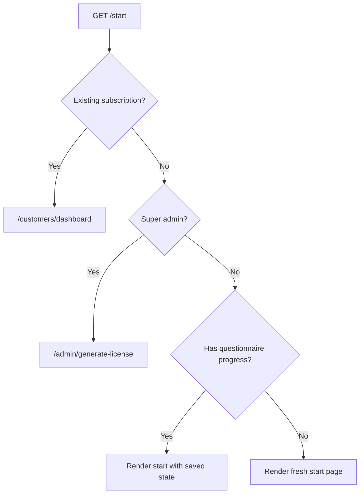

<!-- source-hash: 068841abbb4ad9d07885380ad4727355 -->
Sails.js action that handles routing logic for the "Start" page, redirecting users based on their subscription or admin status, and restoring questionnaire progress for returning users.

## Key Components

**Exits**
- `success` — Renders `pages/start` view template
- `redirect` — Used when the user should be sent elsewhere (subscription exists or superadmin)

**fn (async)**
Core handler logic with three routing branches:
- **Existing subscription** → redirects to `/customers/dashboard`
- **Super admin** → redirects to `/admin/generate-license`
- **Returning questionnaire user** → passes `currentStep` and `previouslyAnsweredQuestions` to the view
- **New user** → renders the start page with no state

## Usage Example

```javascript
// Registered as a route in config/routes.js
'GET /start': { action: 'view-start' }

// The action checks session user (this.req.me) automatically via Sails policies.
// Returning users with questionnaire progress will receive:
{
  currentStep: 'step-2',
  previouslyAnsweredQuestions: { teamSize: '50-200', role: 'IT Admin' }
}
```

## Redirect Logic Flow



**Source:** [`view-start.js`](https://github.com/flamingo-stack/fleetmdm/blob/main/view-start.js)