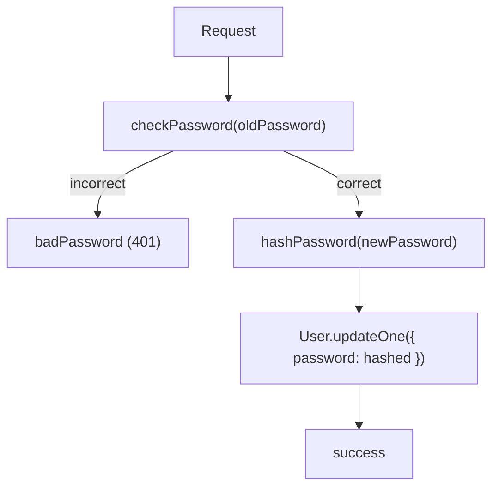

<!-- source-hash: 0f8f36e5eefa64324c9b10ae3cd37425 -->
Sails.js action that handles password updates for authenticated users, validating the current password before replacing it with a newly hashed value.

## Key Components

| Element | Description |
|---|---|
| `oldPassword` | Required input — the user's current plaintext password for verification |
| `newPassword` | Required input — the new plaintext password to set |
| `badPassword` exit | Returns `401 Unauthorized` if the old password doesn't match |
| `success` exit | Confirms the password was updated successfully |

## Usage Example

```javascript
// Called via POST /api/v1/account/update-password (or similar route)
await fetch('/api/v1/account/update-password', {
  method: 'POST',
  headers: { 'Content-Type': 'application/json' },
  body: JSON.stringify({
    oldPassword: 'currentPass123',
    newPassword: 'newSecurePass456'
  })
});
```

## Flow



## Notes

- Requires an authenticated session — relies on `this.req.me` for the current user's `id` and `password`
- Password verification and hashing delegate to `sails.helpers.passwords.checkPassword` and `sails.helpers.passwords.hashPassword`
- Source: [`update-password.js`](https://github.com/flamingo-stack/fleetmdm/blob/main/update-password.js)