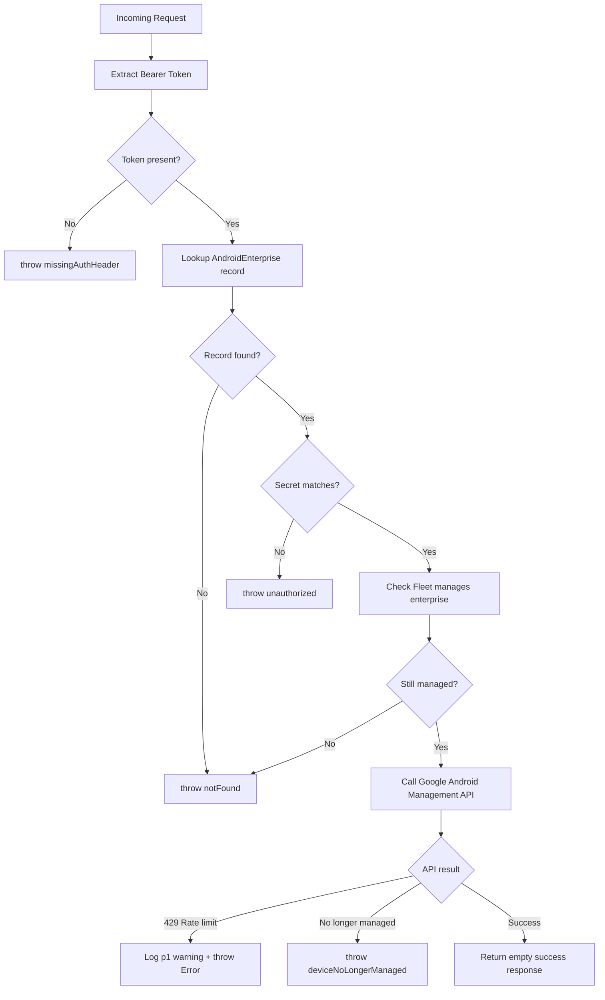

<!-- source-hash: ee114c811a732901079ce576efa4a5ff -->
Sails.js action that handles deletion of a device from an Android Enterprise enrollment via the Google Android Management API, with Bearer token authentication and enterprise ownership validation.

## Key Components

| Export | Type | Description |
|--------|------|-------------|
| `friendlyName` | `string` | Human-readable action name |
| `inputs.androidEnterpriseId` | `string` | ID of the Android Enterprise |
| `inputs.deviceId` | `string` | ID of the device to delete |
| `exits.success` | exit | Device successfully deleted |
| `exits.missingAuthHeader` | exit | Missing `Authorization` Bearer header |
| `exits.unauthorized` | exit | Invalid Fleet server secret |
| `exits.notFound` | exit | Enterprise not found or no longer managed by Fleet |
| `exits.deviceNoLongerManaged` | exit | Device is no longer managed by the enterprise |

## Request Flow



## Usage Example

```bash
curl -X DELETE https://your-fleet-server/delete-android-device \
  -H "Authorization: Bearer <fleetServerSecret>" \
  -d '{
    "androidEnterpriseId": "LC04ax...",
    "deviceId": "device-abc123"
  }'
```

## Error Handling

| Scenario | Response |
|----------|----------|
| Missing `Authorization` header | `401 Unauthorized` |
| Secret mismatch | `401 Unauthorized` |
| Enterprise not in DB or not Fleet-managed | `404 Not Found` |
| Device no longer managed | `404 Not Found` |
| Google API rate limit (429) | Server error + `p1` warning log |
| Other Google API errors | Server error with inspection details |

> **Source:** [`delete-android-device.js`](https://github.com/flamingo-stack/fleetmdm/blob/main/delete-android-device.js)