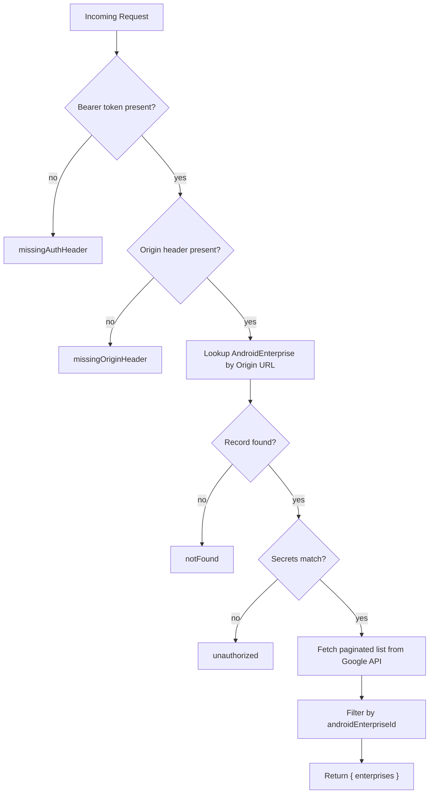

<!-- source-hash: ae58e4cead76e37ec504cc671b45318c -->
Retrieves and filters Android Enterprise records accessible to a Fleet server instance by authenticating via `Bearer` token and `Origin` header, then querying the Google Android Management API.

## Key Components

| Element | Description |
|---|---|
| `missingAuthHeader` | Thrown when `Authorization: Bearer <token>` header is absent |
| `missingOriginHeader` | Thrown when the `Origin` header is missing |
| `unauthorized` | Thrown when the Bearer token doesn't match the stored `fleetServerSecret` |
| `notFound` | Thrown when no `AndroidEnterprise` record matches the request's origin URL |
| `enterprisesList` | Paginated fetch of all Google-managed enterprises (page size: 100) |
| `filteredEnterprises` | Filters results to only the enterprise matching `thisAndroidEnterprise.androidEnterpriseId` |

## Usage Example

```bash
# Request from a Fleet server
curl -X GET https://your-fleetmdm-host/api/android-enterprises \
  -H "Authorization: Bearer <fleet-server-secret>" \
  -H "Origin: https://your-fleet-server.example.com"
```

```json
{
  "enterprises": [
    {
      "name": "enterprises/LC01ab2cd3e",
      "enterpriseDisplayName": "Acme Corp Devices"
    }
  ]
}
```

## Auth Flow



## Notes

- Pagination is handled automatically via `sails.helpers.flow.until`, collecting all pages before filtering.
- HTTP 429 responses from the Google API trigger a `p1` warning log for alerting purposes.
- Requires `androidEnterpriseServiceAccountEmailAddress`, `androidEnterpriseServiceAccountPrivateKey`, and `androidEnterpriseProjectId` in `sails.config.custom`.

**Source:** [`get-android-enterprises.js`](https://github.com/flamingo-stack/fleetmdm/blob/main/get-android-enterprises.js)