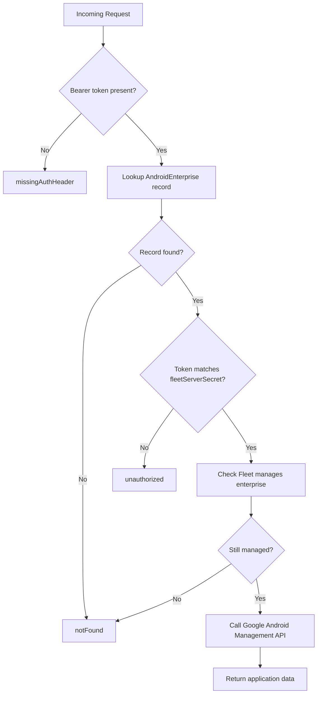

<!-- source-hash: f44cd6e5df70e07c069056a92abe9a77 -->
Retrieves details for a specific application within an Android Enterprise, authenticating via Bearer token and proxying the request to the Google Android Management API.

## Key Components

| Element | Description |
|---|---|
| `androidEnterpriseId` | Required input identifying the Android Enterprise |
| `applicationId` | Required input identifying the specific application to retrieve |
| `missingAuthHeader` | Exit thrown when no `Authorization: Bearer` header is present |
| `unauthorized` | Exit thrown when the Bearer token does not match the stored `fleetServerSecret` |
| `notFound` | Exit thrown when the enterprise or application is not found |
| `deviceNoLongerManaged` | Exit thrown when the enterprise is no longer managed by Fleet |

## Usage Example

```bash
curl -X GET https://your-fleet-server/api/v1/android-enterprise/<enterpriseId>/applications/<appId> \
  -H "Authorization: Bearer <fleetServerSecret>"
```

```javascript
// Internal Sails.js call pattern
await sails.helpers.flow.build(async () => {
  let androidmanagement = google.androidmanagement('v1');
  return await androidmanagement.enterprises.applications.get({
    name: `enterprises/${androidEnterpriseId}/applications/${applicationId}`,
  });
});
```

## Authentication Flow



**Rate limiting:** A `429` from the Google API logs a `p1` priority warning to trigger alerting.