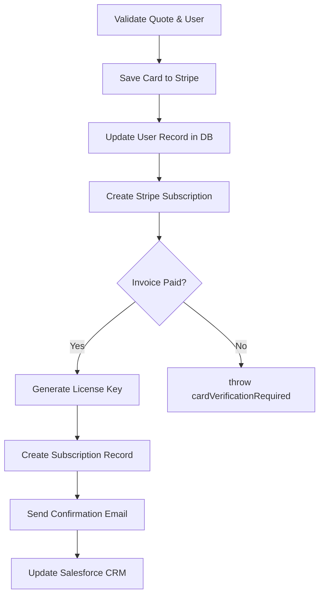

<!-- source-hash: 48319e9e8ae02537abfa849a59e65561 -->
Handles the end-to-end flow of saving a user's billing information and creating a Fleet Premium subscription, including Stripe payment processing, license key generation, database updates, and confirmation email delivery.

## Key Components

| Export | Description |
|--------|-------------|
| `quoteId` | Required input referencing an existing quote to determine pricing and host count |
| `paymentSource` | Required Stripe token and card metadata used to save billing info |
| `couldNotSaveBillingInfo` | Exit triggered when Stripe rejects the provided card |
| `cardVerificationRequired` | Exit triggered when the Stripe invoice is not immediately paid |
| `fn` | Main async function orchestrating the full subscription lifecycle |

## Usage Example

```javascript
// Called as a Sails.js action (e.g., via POST /api/v1/billing/subscribe)
await sails.helpers.saveBillingInfoAndSubscribe.with({
  quoteId: 42,
  organization: 'Acme Corp',
  firstName: 'Jane',
  lastName: 'Doe',
  paymentSource: {
    stripeToken: 'tok_199k3qEXw14QdSnRwmsK99MH',
    billingCardLast4: '4242',
    billingCardBrand: 'visa',
    billingCardExpMonth: '08',
    billingCardExpYear: '2025',
  }
});
```

## Flow Overview



**Source:** [`save-billing-info-and-subscribe.js`](https://github.com/flamingo-stack/fleetmdm/blob/main/save-billing-info-and-subscribe.js)