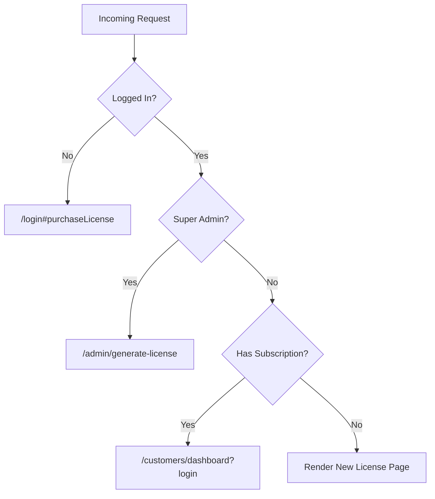

<!-- source-hash: f5f32a4c3b3fa96f16dbdadcd780d3d6 -->
Handles routing logic for the "New License" purchase page, redirecting users based on authentication and subscription status before rendering the license purchase form.

## Key Components

**Exits**
- `success` — Renders `pages/customers/new-license` with Stripe publishable key
- `redirect` — Redirects users who are ineligible to view the page

**fn (async)**
Core handler that enforces access rules in sequence:
1. Unauthenticated users → `/login#purchaseLicense`
2. Super admins → `/admin/generate-license`
3. Users with an existing `Subscription` record → `/customers/dashboard?login`
4. Eligible users → renders the page with `stripePublishableKey`

## Usage Example

```javascript
// Sails.js route binding (config/routes.js)
'GET /new-license': { action: 'view-new-license' }

// The action resolves stripePublishableKey from Sails config:
// config/custom.js
module.exports.custom = {
  stripePublishableKey: 'pk_live_...',
};

// Subscription lookup used internally:
let userHasExistingSubscription = await Subscription.findOne({
  user: this.req.me.id
});
```

## Access Control Flow



## Notes

- Relies on `sails.config.custom.stripePublishableKey` being configured — the key is passed to the view for client-side Stripe integration
- Uses the `Subscription` Waterline model to determine existing subscription status
- Part of the FleetMDM customer licensing flow — source at [`view-new-license.js`](https://github.com/flamingo-stack/fleetmdm/blob/main/api/controllers/view-new-license.js)