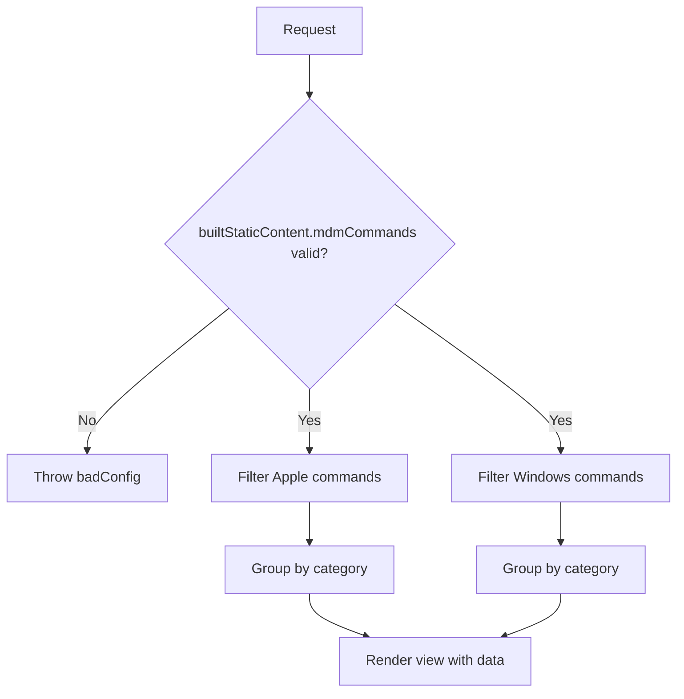

<!-- source-hash: af60ea54b4a21d4bd635ae41e08bb778 -->
Renders the MDM Commands documentation page by filtering and grouping platform-specific commands from static content for display.

## Key Components

- **`exits.success`** – Renders the `pages/docs/mdm-commands` view template
- **`exits.badConfig`** – Returns a `badConfig` response if static content is misconfigured
- **`fn`** – Main handler that validates config, splits commands by platform, and groups them by category

## Usage Example

```javascript
// Sails.js routes the request to this action, which returns:
{
  appleCommands,       // All commands where platform === 'apple'
  appleCategories,     // Apple commands grouped by category
  windowsCommands,     // All commands where platform === 'windows'
  windowsCategories,   // Windows commands grouped by category
  algoliaPublicKey,    // Public key for Algolia search
}
```

## Data Flow



## Notes

- Requires `sails.config.builtStaticContent.mdmCommands` to be a populated array at startup; throws `badConfig` otherwise
- Commands must have `platform` (`'apple'` or `'windows'`) and `category` fields for filtering and grouping to work correctly
- Source: [`view-mdm-commands.js`](https://github.com/flamingo-stack/fleetmdm/blob/main/view-mdm-commands.js)