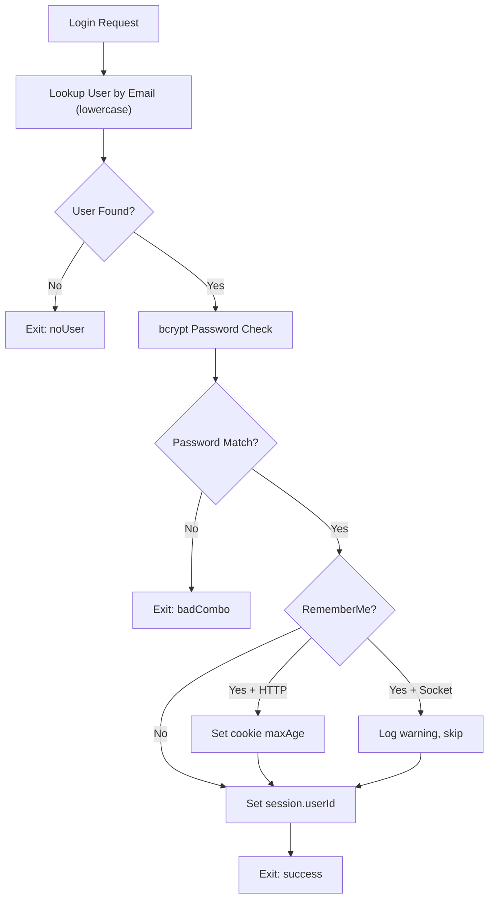

<!-- source-hash: ec7f1f9b3dcf8b151e5ff36d5fffa1d9 -->
Handles user authentication by validating email/password credentials against the database and establishing a session for successful logins.

## Key Components

**Inputs**
| Parameter | Type | Required | Description |
|---|---|---|---|
| `emailAddress` | `string` | ✅ | User's email address (validated format) |
| `password` | `string` | ✅ | Plain-text password attempt |
| `rememberMe` | `boolean` | ❌ | Extends session lifetime via cookie `maxAge` |

**Exits**
| Exit | Response Type | Description |
|---|---|---|
| `success` | `200` | Session created; `userId` stored in `req.session` |
| `badCombo` | `unauthorized` | Email found but password mismatch |
| `noUser` | `unauthorized` | No user found with provided email |

## Authentication Flow



## Usage Example

```javascript
// POST /api/v1/auth/login
const response = await fetch('/api/v1/auth/login', {
  method: 'POST',
  headers: { 'Content-Type': 'application/json' },
  body: JSON.stringify({
    emailAddress: 'user@example.com',
    password: 'mySecurePassword',
    rememberMe: true
  })
});
```

## Notes

- Email lookups are **case-insensitive** (lowercased before query)
- Password comparison uses `sails.helpers.passwords.checkPassword` (bcrypt)
- `rememberMe` is **not supported** over WebSocket/virtual requests — a warning is logged and the flag is silently ignored
- On success, `req.me` is automatically populated on subsequent requests via the custom Sails hook

**Source:** [`api/controllers/entrance/login.js`](https://github.com/flamingo-stack/fleetmdm/blob/main/api/controllers/entrance/login.js)