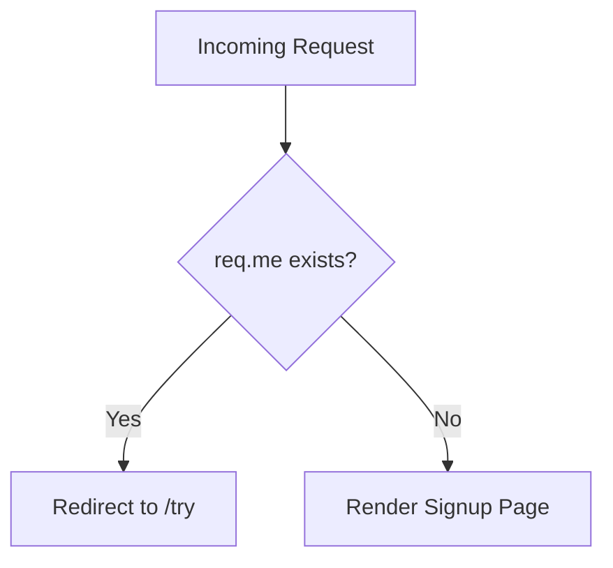

<!-- source-hash: 58376839b190db7ce1c43685c58fe69d -->
Renders the signup page for unauthenticated users, redirecting already-logged-in users away from the registration flow.

## Key Components

| Export | Type | Description |
|--------|------|-------------|
| `friendlyName` | `string` | Human-readable action name: `'View signup'` |
| `description` | `string` | Brief summary of the action's purpose |
| `exits.success` | `object` | Renders `pages/entrance/signup` view template |
| `exits.redirect` | `object` | Redirects authenticated users (type: `redirect`) |
| `fn` | `async function` | Core handler — checks session and routes accordingly |

## Logic Flow



## Usage Example

This is a Sails.js action registered as a route in `config/routes.js`:

```javascript
// config/routes.js
module.exports.routes = {
  'GET /signup': { action: 'entrance/view-signup' }
};
```

When a user visits `/signup`:
- **Authenticated users** (`req.me` is set) are redirected to `/try`
- **Unauthenticated users** receive the signup page at `pages/entrance/signup`

## Notes

- Part of the **entrance** action group, following Sails.js conventions
- No inputs are accepted — the action is purely navigational
- Authentication state is derived from `this.req.me`, typically populated via session middleware
- Source: [`flamingo-stack/fleetmdm`](https://github.com/flamingo-stack/fleetmdm)