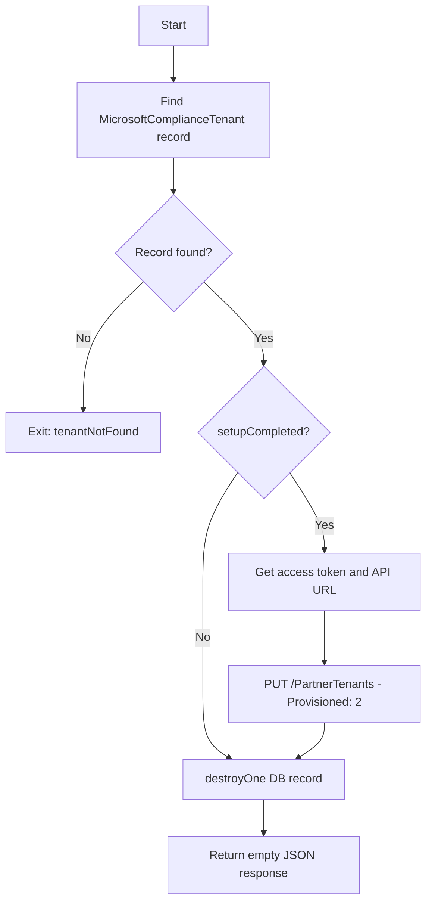

<!-- source-hash: 4bf42642558cac227b8cbe15844fd344 -->
Handles deprovisioning of a Microsoft compliance partner tenant by updating its status to "deprovisioned" via the Microsoft API and deleting the associated database record.

## Key Components

- **`entraTenantId`** *(required)*: The Entra tenant ID identifying the Microsoft compliance tenant to remove.
- **`fleetServerSecret`** *(required)*: Secret used to authenticate and locate the tenant record.
- **`tenantNotFound` exit**: Returned when no matching `MicrosoftComplianceTenant` record is found.
- **Conditional deprovisioning**: If `setupCompleted` is `true`, the helper `microsoftProxy.getAccessTokenAndApiUrls` is called to obtain an access token and API URL before sending a `PUT` request to mark the tenant as deprovisioned (`Provisioned: 2`).
- **`MicrosoftComplianceTenant.destroyOne`**: Deletes the database record after deprovisioning (or immediately if setup was never completed).

## Usage Example

```javascript
await sails.helpers.removeOneCompliancePartnerTenant.with({
  entraTenantId: 'xxxxxxxx-xxxx-xxxx-xxxx-xxxxxxxxxxxx',
  fleetServerSecret: 'your-fleet-server-secret',
});
```

## Flow



## Notes

- Deprovisioning sets `Provisioned: 2` against the Microsoft Manage API endpoint; `1` means provisioned, `2` means deprovisioned.
- API responses are logged via `sails.log.info` only for the `dogfood.fleetdm.com` Fleet instance.
- If tenant setup was never completed, the Microsoft API call is skipped and only the database record is removed.