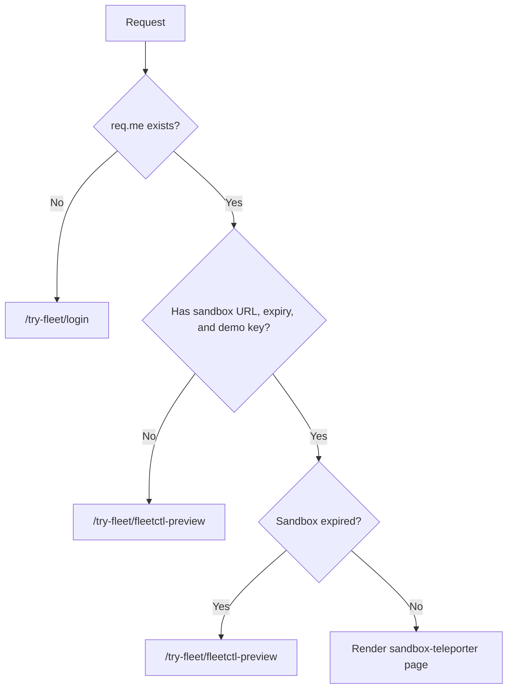

<!-- source-hash: 4f9a700e8c6660c07258c82c51cbe6e8 -->
Handles routing logic for Fleet Sandbox access by displaying an auto-submitting teleporter page that authenticates users into their sandbox instance, or redirecting them based on sandbox expiry, missing credentials, or waitlist status.

## Key Components

- **`friendlyName`** – `'View sandbox teleporter or redirect because sandbox expired or waitlist'`
- **`exits.success`** – Renders `pages/try-fleet/sandbox-teleporter`, the interstitial form that sets browser `localStorage` to authenticate the user on the sandbox domain
- **`exits.redirect`** – Redirects users who lack a valid sandbox instance
- **`fn`** – Core handler containing three guard redirects and one success path

## Routing Logic



## Usage Example

```javascript
// Registered as a route in config/routes.js
'GET /try-fleet/sandbox': {
  action: 'view-sandbox-teleporter-or-redirect-because-expired-or-waitlist'
}

// On success, the rendered page receives:
{
  hideHeaderOnThisPage: true  // Suppresses nav header on the teleporter interstitial
}
```

## Notes

- The teleporter page works as an auto-submitting HTML form that grabs HTML from the Fleet Sandbox instance (running on a separate domain) and stores authentication state in `localStorage`
- All three failure cases redirect to `/try-fleet/fleetctl-preview` as a graceful fallback
- A `FUTURE` comment in the source notes this controller should be removed once all active sandbox instances have expired
- See [Fleet PR #6380](https://github.com/fleetdm/fleet/pull/6380) for original implementation context

**Source:** [`view-sandbox-teleporter-or-redirect-because-expired-or-waitlist.js`](https://github.com/flamingo-stack/fleetmdm/blob/main/view-sandbox-teleporter-or-redirect-because-expired-or-waitlist.js)