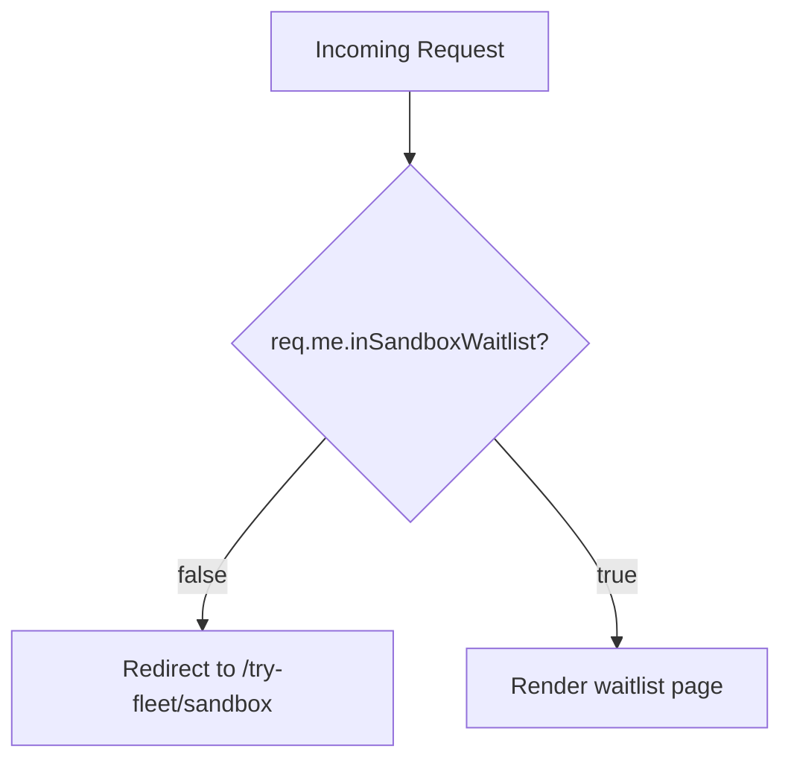

<!-- source-hash: a79d6a2dff1c151dbe2cb9f6681a22ff -->
Sails.js page action that renders the Fleet Sandbox waitlist page, redirecting users who are not in the waitlist queue back to the sandbox entry point.

## Key Components

| Export | Type | Description |
|--------|------|-------------|
| `friendlyName` | `string` | Human-readable name: `'View waitlist'` |
| `description` | `string` | Brief description of the action's purpose |
| `exits.success` | `object` | Renders `pages/try-fleet/waitlist` view template |
| `exits.redirect` | `object` | Redirects users without a valid waitlist status |
| `fn` | `async function` | Core action handler with waitlist guard logic |

## Logic Flow



## Usage Example

This action is registered as a Sails.js route target. When a user navigates to the waitlist page, the action validates their waitlist status before rendering:

```javascript
// config/routes.js
'GET /try-fleet/waitlist': { action: 'view-waitlist' }
```

The guard inside `fn` ensures only users flagged with `inSandboxWaitlist: true` on their session (`req.me`) can view the page:

```javascript
// Guard logic
if (!this.req.me.inSandboxWaitlist) {
  throw { redirect: '/try-fleet/sandbox' };
}
// Authenticated waitlist users reach this point
return {};
```

## Notes

- Requires an authenticated session (`req.me` must be populated)
- Non-waitlist users are silently redirected to `/try-fleet/sandbox`
- No data is passed to the view template on success

---

**Source:** [`view-waitlist.js`](https://github.com/flamingo-stack/fleetmdm/blob/main/view-waitlist.js)