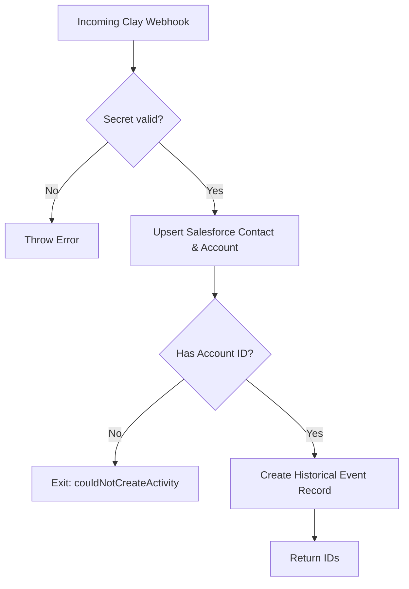

<!-- source-hash: 452c027f292ded429520285f90e22f75 -->
Handles incoming webhook requests from Clay, validating the secret, upserting a Salesforce contact/account, and logging an intent signal as a historical event record.

## Key Components

| Element | Description |
|---|---|
| `webhookSecret` | Validates the incoming request against `sails.config.custom.clayWebhookSecret` |
| `contactSource` | Enum of recognized lead origins (website forms, GitHub, LinkedIn, events) |
| `intentSignal` | Enum of recognized intent signals (LinkedIn activity, GitHub stars/forks, newsletter, meetings, etc.) |
| `duplicateContactOrAccountFound` | Exit (409) triggered when Salesforce detects a duplicate record |
| `couldNotCreateActivity` | Exit triggered when the contact has no associated Salesforce account or event creation fails |

## Usage Example

```javascript
// POST /webhooks/receive-from-clay
await sails.helpers.receiveFromClay.with({
  webhookSecret: 'your-clay-webhook-secret',
  firstName: 'Jane',
  lastName: 'Doe',
  linkedinUrl: 'https://linkedin.com/in/janedoe',
  emailAddress: 'jane@example.com',
  contactSource: 'LinkedIn - Reaction',
  jobTitle: 'IT Manager',
  intentSignal: 'LinkedIn reaction',
  historicalContent: 'Reacted to Fleet post about MDM',
  historicalContentUrl: 'https://linkedin.com/posts/fleetdm/...',
  relatedCampaign: 'Q1 LinkedIn Awareness',
});
// Returns: { historicalRecordId, contactId, accountId }
```

## Flow



## Source

[`receive-from-clay.js`](https://github.com/flamingo-stack/fleetmdm/blob/main/receive-from-clay.js)