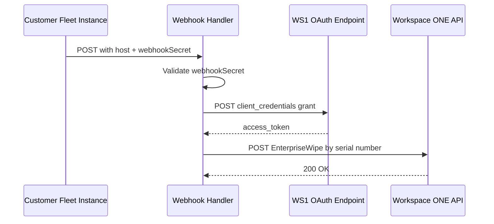

<!-- source-hash: 540d21f6a0717fa47d189d841521b901 -->
Webhook handler that receives MDM migration events from a customer's Fleet instance and triggers host unenrollment from their VMware Workspace ONE MDM environment.

## Key Components

### Inputs
| Parameter | Type | Description |
|-----------|------|-------------|
| `timestamp` | `string` | ISO 8601 timestamp of the request (informational only) |
| `host` | `object` | Host details (`id`, `uuid`, `hardware_serial`) to unenroll |
| `webhookSecret` | `string` | Shared secret for authenticating the incoming webhook |

### Exits
- **`unauthorized`** — Webhook secret did not match the configured value
- **`badRequest`** — Workspace ONE rejected the unenrollment request (HTTP 400)

### Required Sails Config
| Key | Purpose |
|-----|---------|
| `customerWorkspaceOneBaseUrl` | Base URL of the customer's Workspace ONE instance |
| `customerWorkspaceOneOauthId` | OAuth client ID for Workspace ONE API access |
| `customerWorkspaceOneOauthSecret` | OAuth client secret for Workspace ONE API access |
| `customerMigrationWebhookSecret` | Shared secret to validate incoming Fleet webhooks |

## Usage Example

```javascript
// Example Fleet webhook payload sent to this handler
{
  timestamp: "2024-01-15T10:30:00Z",
  host: {
    id: 42,
    uuid: "abc123-def456",
    hardware_serial: "C02XL1ZXJG5H"
  },
  webhookSecret: "your-shared-secret"
}
```

## Flow



> **Security note:** This webhook validates requests using a shared secret (`webhookSecret`) and should always be served over TLS. The `EnterpriseWipe` command in Workspace ONE performs an MDM unenrollment only — it does not wipe device data.